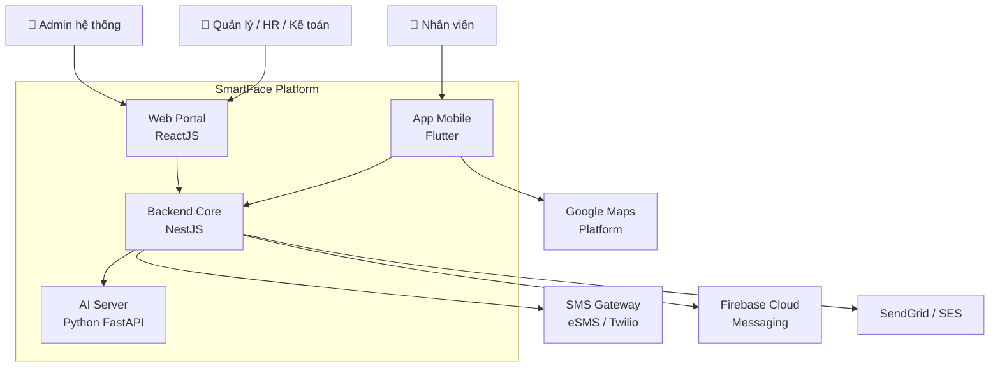

# 02 — Kiến trúc hệ thống SmartFace

> Chuẩn hoá từ Chương I.3 và Chương VII của tài liệu PA.
> Đây là tài liệu **chính thức để thi công**. Mọi lệch pha giữa code và tài liệu này phải được ghi nhận bằng một ADR mới.


> ⚠ **LUỒNG XÁC THỰC ĐÃ ĐỔI.** Tài liệu này còn mô tả cách đăng nhập bằng OTP và
> mã mời. Cách làm hiện tại: danh tính do **Firebase Authentication** quản lý —
> client đăng nhập với Firebase bằng **email + mật khẩu** rồi đổi ID token lấy
> phiên của Backend qua `POST /auth/session` (kèm tên miền công ty). Tài khoản do
> HR cấp sẵn, đăng nhập lần đầu bắt buộc đổi mật khẩu; xác thực 2 lớp là tuỳ chọn,
> dùng **OTP gửi qua SMS**. Mã mời và TOTP (Google Authenticator) đã bỏ hẳn.
>
> Mô tả đúng: [01 mục 9](./01-tong-quan-he-thong.md#9-cấp-tài-khoản-và-gia-nhập-công-ty) ·
> [08 mục 2](./08-hop-dong-api.md#2-api-xác-thực-auth) ·
> [13](./13-luong-onboarding-va-dang-ky-khuon-mat.md)
>
> Phần nghiệp vụ còn lại trong tài liệu này vẫn đúng.

---

## 1. Nguyên tắc kiến trúc

Năm nguyên tắc dưới đây được rút ra trực tiếp từ PA. Chúng chi phối toàn bộ thiết kế và **không được vi phạm** trong quá trình thi công.

| # | Nguyên tắc | Hệ quả thiết kế |
|---|---|---|
| **P1** | **Tách AI Server độc lập với Backend Core** | AI Server chạy riêng container/pod, scale riêng theo GPU, nâng cấp/thay model không ảnh hưởng hệ thống chính. Giao tiếp qua REST nội bộ + hàng đợi. |
| **P2** | **Không tin dữ liệu xác thực từ client** (`BR-02`) | App không bao giờ gửi `faceVerified: true`. App gửi **ảnh/bằng chứng thô**, Backend tự gọi AI Server để kiểm chứng và tự ra quyết định. |
| **P3** | **AI Server không ra quyết định nghiệp vụ** | AI Server trả về số liệu (match score, liveness score, quality). Backend so với ngưỡng cấu hình để quyết định. Đổi ngưỡng không cần deploy lại model. |
| **P4** | **Multi-tenant từ ngày đầu** (`BR-09`) | Mọi bảng nghiệp vụ có `company_id`. Mọi query có guard lọc tenant. Không có "sẽ thêm sau". |
| **P5** | **Audit-first: bản ghi thô bất biến** (`BR-06`) | Tách bản ghi chấm công **thô** (bất biến) khỏi bản ghi **đã tính** (tính lại được). Mọi hiệu chỉnh là bản ghi mới, không sửa đè. |

---

## 2. Sơ đồ ngữ cảnh (Context Diagram)



---

## 3. Sơ đồ thành phần (Container Diagram)

```
 ┌────────────────────────┐          ┌──────────────────────────────┐
 │  APP NHÂN VIÊN          │          │  WEB QUẢN LÝ + WEB ADMIN     │
 │  Flutter (Dart)         │          │  ReactJS (TS) + Vite + AntD  │
 │  Bloc · Dio · Hive      │          │  TanStack Query · Recharts   │
 │  local_auth · geolocator│          │  Phân quyền module theo role │
 └───────────┬─────────────┘          └───────────────┬──────────────┘
             │  HTTPS + SSL Pinning                   │  HTTPS
             │  JWT + HMAC(nonce, ts)                 │  JWT
             └────────────────┬───────────────────────┘
                              ▼
              ┌───────────────────────────────────┐
              │      API GATEWAY (Kong / Nginx)    │
              │  SSL termination · Rate limiting   │
              └───────────────┬───────────────────┘
                              ▼
       ┌──────────────────────────────────────────────────┐
       │           BACKEND CORE — NestJS (TypeScript)      │
       │  ┌────────┬────────┬────────┬─────────┬────────┐ │
       │  │ auth   │ attend │request │ payroll │ tenant │ │
       │  ├────────┼────────┼────────┼─────────┼────────┤ │
       │  │employee│ policy │ report │  fraud  │ notify │ │
       │  └────────┴────────┴────────┴─────────┴────────┘ │
       │  Guards: JwtAuth · Tenant · RBAC · Signature      │
       └───┬──────────┬──────────┬──────────┬─────────────┘
           │          │          │          │
           ▼          ▼          ▼          ▼
  ┌────────────┐ ┌─────────┐ ┌───────┐ ┌──────────────┐
  │ AI SERVER  │ │Postgre  │ │ Redis │ │ Object Store │
  │ FastAPI    │ │  SQL    │ │+BullMQ│ │  S3 / MinIO  │
  │ InsightFace│ │(+pgvec) │ └───┬───┘ │ ảnh, file đơn│
  │ RetinaFace │ │         │     │     └──────────────┘
  │ Anti-spoof │ │ Prisma/ │     ▼
  │ ONNX + GPU │ │ TypeORM │ ┌────────────────┐
  └────────────┘ └─────────┘ │ WORKER         │
                             │ tính công, SMS,│
                             │ export Excel,  │
                             │ push notify    │
                             └────────────────┘
           │
           ▼
  ┌─────────────────────────────────────────────┐
  │  Elasticsearch + Kibana  (log, audit trail)  │
  │  Prometheus + Grafana + Sentry (giám sát)    │
  └─────────────────────────────────────────────┘
```

---

## 4. Technology Stack

Bảng tổng hợp theo PA mục 7.9, bổ sung phiên bản đề xuất và ghi chú thi công.

| Thành phần | Công nghệ | Phiên bản đề xuất | Ghi chú thi công |
|---|---|---|---|
| App Nhân viên | Flutter (Dart) | Flutter 3.24+ | 1 codebase iOS + Android |
| Web Quản lý & Admin | ReactJS + TypeScript | React 18/19 | **Dùng chung 1 codebase**, phân quyền hiển thị module theo role |
| Build tool Web | Vite | 5+ | Nhanh hơn CRA |
| UI Web | Ant Design **hoặc** MUI | AntD 5 | Nhiều component dashboard/table/form sẵn |
| Backend Core | Node.js + NestJS (TS) | Node 20 LTS, NestJS 10 | Kiến trúc module hoá, DI, guard sẵn |
| ORM | Prisma **hoặc** TypeORM | Prisma 5 | Xem `ADR-04` |
| AI Server | Python + FastAPI | Python 3.11, FastAPI 0.11x | Container riêng |
| Face detection | RetinaFace hoặc MTCNN | — | Qua InsightFace |
| Face embedding | ArcFace / FaceNet (InsightFace) | buffalo_l | Vector 512 chiều |
| Liveness / Anti-spoof | Silent-Face-Anti-Spoofing (MiniFASNet) | ONNX | Hoặc SDK eKYC thương mại — xem `Q4` |
| Tối ưu suy luận | ONNX Runtime (TensorRT nếu GPU NVIDIA) | — | Đảm bảo < 2 giây |
| Database chính | PostgreSQL | 16 | Multi-tenant theo `company_id` |
| Vector search (tuỳ chọn) | pgvector hoặc Milvus | pgvector 0.7 | Chỉ khi quy mô hàng chục nghìn nhân viên |
| Cache & Session | Redis | 7 | OTP, cache dashboard, session |
| Hàng đợi | BullMQ (nền Redis) | 5 | SMS OTP, push hàng loạt, export Excel, gọi AI batch |
| Lưu trữ ảnh/file | S3-compatible (AWS S3 / MinIO) | — | Mã hoá at-rest + lifecycle tự xoá |
| Log & Audit | Elasticsearch + Kibana | 8 | Log hệ thống, log nghi vấn gian lận, audit trail |
| Realtime | Socket.io / NestJS WebSocket Gateway | — | Push kết quả duyệt đơn, cảnh báo gian lận |
| API docs | OpenAPI / Swagger | 3.1 | Tự sinh từ decorator NestJS |
| Kiểm thử BE | Jest | — | Unit + integration |
| Container | Docker | — | Toàn bộ service |
| Điều phối | Kubernetes | 1.29+ | Scale riêng AI Server (GPU) vs Backend (CPU) |
| API Gateway | Kong hoặc Nginx | — | SSL termination, rate limiting |
| CI/CD | GitHub Actions / GitLab CI | — | Build, test, deploy tự động |
| Giám sát | Prometheus + Grafana + Sentry | — | Phục vụ mục 5.3/5.4 của Admin |
| SMS OTP | eSMS / Speed SMS / Twilio | — | Trong nước ưu tiên eSMS |
| Push notification | Firebase Cloud Messaging | — | Chung Android + iOS |
| Bản đồ & Geofencing | Google Maps Platform | — | Maps SDK, Geocoding API |
| Email | SendGrid hoặc Amazon SES | — | Báo cáo định kỳ, thông báo phụ |
| Cloud | AWS/GCP/Azure hoặc Viettel/VNG/FPT Cloud | — | Chọn trong nước nếu yêu cầu data residency VN |

---

## 5. Backend Core — cấu trúc module (NestJS)

### 5.1. Bản đồ module

| Module | Trách nhiệm | Phụ thuộc |
|---|---|---|
| `auth` | OTP login, JWT access/refresh, device binding, session | `notification` (gửi SMS), `tenant` |
| `tenant` | Company, Branch, Department, mã mời, gói dịch vụ | — |
| `employee` | Hồ sơ nhân viên, employee code, vòng đời, import Excel | `tenant` |
| `biometric` | Đăng ký/reset khuôn mặt & vân tay, gọi AI Server | `employee`, `ai-gateway`, `storage` |
| `attendance` | Chấm công vào/ra, bản ghi thô, bản ghi ngày | `biometric`, `policy`, `fraud`, `ai-gateway` |
| `request` | Đơn từ, workflow duyệt nhiều cấp, đính kèm | `employee`, `policy`, `notification` |
| `policy` | Ca làm việc, phân ca, ngày lễ, phép năm, quy tắc tính công, geofence | `tenant` |
| `payroll` | Engine tính công, tính OT, phạt, kỳ lương, chốt kỳ, export | `attendance`, `request`, `policy` |
| `report` | Dashboard, thống kê, biểu đồ, báo cáo | `attendance`, `request`, `payroll` |
| `fraud` | Đánh giá rủi ro từng lượt chấm công, gắn cờ, dashboard cảnh báo | `attendance`, `audit` |
| `notification` | Push FCM, SMS, email, thông báo nội bộ | — |
| `audit` | Ghi và truy vấn audit log | — |
| `admin` | Quản trị toàn hệ thống, giám sát AI, cấu hình chung | tất cả (chỉ đọc + can thiệp có kiểm soát) |
| `ai-gateway` | Client giao tiếp AI Server (REST + queue), retry, circuit breaker | — |
| `storage` | Upload/download S3, presigned URL, lifecycle | — |

### 5.2. Cấu trúc thư mục đề xuất

```
backend/
├── src/
│   ├── main.ts
│   ├── app.module.ts
│   ├── common/
│   │   ├── guards/          # JwtAuthGuard, TenantGuard, RolesGuard, SignatureGuard
│   │   ├── interceptors/    # LoggingInterceptor, AuditInterceptor, TransformInterceptor
│   │   ├── filters/         # AllExceptionsFilter (chuẩn hoá error code)
│   │   ├── decorators/      # @CurrentUser() @CurrentTenant() @Roles() @Audit()
│   │   ├── pipes/           # ZodValidationPipe / class-validator
│   │   └── errors/          # bảng mã lỗi tập trung (xem mục 9)
│   ├── config/              # cấu hình theo môi trường, validate bằng schema
│   ├── infra/
│   │   ├── prisma/          # PrismaService (singleton), migrations
│   │   ├── redis/
│   │   ├── queue/           # BullMQ producers + processors
│   │   ├── storage/         # S3/MinIO client
│   │   └── logger/          # pino → Elasticsearch
│   └── modules/
│       ├── auth/
│       │   ├── auth.controller.ts
│       │   ├── auth.service.ts
│       │   ├── dto/
│       │   ├── strategies/
│       │   └── auth.module.ts
│       ├── tenant/
│       ├── employee/
│       ├── biometric/
│       ├── attendance/
│       ├── request/
│       ├── policy/
│       ├── payroll/
│       ├── report/
│       ├── fraud/
│       ├── notification/
│       ├── audit/
│       ├── ai-gateway/
│       └── admin/
├── test/
├── prisma/schema.prisma
└── Dockerfile
```

**Quy ước bắt buộc trong mỗi module:**

```
Controller  →  chỉ nhận request, validate DTO, gọi Service. KHÔNG chứa business logic.
Service     →  toàn bộ nghiệp vụ. KHÔNG truy cập trực tiếp Prisma nếu module có Repository.
Repository  →  truy vấn dữ liệu. LUÔN nhận companyId làm tham số bắt buộc.
DTO         →  validate đầu vào bằng class-validator/Zod. Không dùng `any`.
```

---

## 6. AI Server — thiết kế

### 6.1. Nguyên tắc

AI Server **chỉ trả số liệu, không ra quyết định** (`P3`). Backend giữ toàn quyền quyết định dựa trên ngưỡng cấu hình theo từng công ty.

### 6.2. API nội bộ

AI Server **không expose ra internet**, chỉ nhận request từ Backend Core trong mạng nội bộ, xác thực bằng API key riêng (`X-Internal-Key`).

| Endpoint | Mục đích | Chế độ |
|---|---|---|
| `POST /v1/enroll` | Trích embedding từ ảnh đăng ký, kiểm tra chất lượng + liveness | Đồng bộ |
| `POST /v1/verify` | So khớp 1:1 — ảnh vs embedding của nhân viên đã biết | Đồng bộ (chấm công realtime) |
| `POST /v1/identify` | So khớp 1:N trong một tập `scope_ids` | Đồng bộ (kiosk, giai đoạn sau) |
| `POST /v1/liveness` | Chỉ kiểm tra liveness | Đồng bộ |
| `POST /v1/batch/audit` | Đối chiếu ngẫu nhiên hàng loạt ảnh chấm công vs ảnh hồ sơ | Bất đồng bộ (queue) |
| `GET /health` | Health check + model version + tình trạng GPU | — |
| `GET /metrics` | Prometheus metrics | — |

Chi tiết payload xem [08 — Hợp đồng API](./08-hop-dong-api.md).

### 6.3. Pipeline xử lý

```
Ảnh vào
  │
  ├─ 1. Kiểm tra chất lượng ảnh (blur, độ sáng, kích thước khuôn mặt, góc nghiêng)
  │      └─ FAIL → trả error code cụ thể (IMG_TOO_DARK, IMG_BLURRY, FACE_TOO_SMALL...)
  │
  ├─ 2. Face detection (RetinaFace)
  │      ├─ 0 khuôn mặt  → FACE_NOT_FOUND
  │      └─ >1 khuôn mặt → MULTIPLE_FACES
  │
  ├─ 3. Face alignment (chuẩn hoá 112×112 theo 5 điểm mốc)
  │
  ├─ 4. Liveness / anti-spoofing (MiniFASNet)
  │      └─ score < ngưỡng → LIVENESS_FAILED (kèm score để Backend tự quyết)
  │
  ├─ 5. Embedding (ArcFace, vector 512 chiều, đã L2-normalize)
  │
  └─ 6. So khớp
         ├─ verify (1:1): cosine similarity với embedding đã lưu
         └─ identify (1:N): so với ma trận embedding trong scope, trả top-K + margin
```

### 6.4. Ngưỡng và cấu hình

Ngưỡng **không hard-code trong AI Server**. Backend lưu ngưỡng theo từng công ty trong `SystemConfig` / `CompanyPolicy` và tự áp dụng lên số liệu AI trả về.

| Tham số | Giá trị khởi điểm | Ghi chú |
|---|---|---|
| `face_match_threshold` (1:1) | 0.45 (cosine, ArcFace) | Cần hiệu chỉnh theo dữ liệu thực tế |
| `face_match_threshold` (1:N) | 0.55 + margin ≥ 0.10 | 1:N khắt khe hơn nhiều, xem `00-kien-thuc-nen-tang.md` Phần 2 |
| `liveness_threshold` | 0.70 | Cân bằng FAR/FRR |
| `min_face_pixels` | 112 | Nhỏ hơn thì từ chối |
| `max_processing_ms` | 2000 | Vượt → timeout, trả lỗi rõ ràng |

> **Lưu ý quan trọng:** ngưỡng phải được **hiệu chỉnh bằng dữ liệu thật của khách hàng**, không dùng thẳng giá trị mặc định lên production. Cần một quy trình đo FAR/FRR trước khi go-live.

---

## 7. Chiến lược Multi-tenant

### 7.1. Mô hình chọn: **Shared database, shared schema, phân tách bằng `company_id`**

| Tiêu chí | Lựa chọn |
|---|---|
| Mặc định | Shared schema + cột `company_id` trên mọi bảng nghiệp vụ |
| Công ty rất lớn / yêu cầu cách ly cao | Tách schema riêng (`schema-per-tenant`) — nâng cấp sau, không phải thi công ngay |
| Enforce | `TenantGuard` gắn `company_id` vào request context; Repository **bắt buộc** nhận `companyId`; bổ sung Postgres Row-Level Security làm lớp phòng thủ thứ hai |

### 7.2. Cách enforce trong code

```ts
// common/guards/tenant.guard.ts — gắn companyId vào request từ JWT
// Mọi repository method BẮT BUỘC có tham số companyId, không có default.

// ĐÚNG
findAttendance(companyId: string, filter: AttendanceFilter) {
  return this.prisma.attendanceLog.findMany({
    where: { companyId, ...filter },   // companyId luôn ở đầu where
  });
}

// SAI — thiếu companyId → rò rỉ dữ liệu chéo tenant
findAttendance(filter: AttendanceFilter) {
  return this.prisma.attendanceLog.findMany({ where: filter });
}
```

**Kiểm soát bắt buộc:** viết một integration test quét toàn bộ endpoint, đăng nhập bằng tenant A và xác nhận không endpoint nào trả về dữ liệu của tenant B.

### 7.3. Trường hợp một tài khoản thuộc nhiều công ty

```
UserAccount (1 số điện thoại)
     │
     ├── Employee @ Company A   ← employee code: ducnv.amobi
     └── Employee @ Company B   ← employee code: ducnv.xyzco
```

- JWT chứa `userId` + `activeEmployeeId` + `companyId` của công ty đang hoạt động.
- Switch company = cấp lại token với `companyId` mới, **không cần đăng nhập lại**.
- Dữ liệu sinh trắc học: embedding khuôn mặt lưu **theo từng Employee** (không dùng chung), vì mỗi công ty có chính sách lưu trữ/xoá dữ liệu riêng và có quyền yêu cầu xoá độc lập.

---

## 8. Bảo mật

### 8.1. Xác thực & phân quyền

```
Đăng nhập:  SĐT → OTP (Redis, TTL 3-5 phút, giới hạn 5 lần nhập sai)
              → cấp Access Token (JWT, TTL ngắn ~15 phút)
              + Refresh Token (TTL dài, xoay vòng, gắn với device_id)

Access Token payload:
{
  sub: userId,
  employeeId, companyId, roles: ["EMPLOYEE"],
  deviceId,                 ← token gắn với thiết bị cụ thể (BR-11)
  jti, iat, exp
}
```

- **RBAC** 5 vai trò: `SYSTEM_ADMIN`, `COMPANY_ADMIN`, `MANAGER`, `HR_PAYROLL`, `EMPLOYEE`.
- `MANAGER` bị giới hạn thêm theo **phạm vi phòng ban** — không chỉ role mà còn scope. Cần một `ScopeGuard` riêng bên cạnh `RolesGuard`.
- Refresh token bị **thu hồi ngay** khi: đổi thiết bị, chấm dứt hợp đồng, Admin khoá tài khoản, reset sinh trắc học.

### 8.2. Bảo vệ endpoint chấm công (chống replay & bot)

Endpoint chấm công là mục tiêu tấn công chính. Áp dụng đồng thời:

```
Request chấm công gồm:
  - Ảnh khuôn mặt (binary) HOẶC device biometric assertion
  - device_id, nonce (dùng 1 lần), client_timestamp
  - GPS: lat, lng, accuracy, provider, is_mock
  - X-Signature: HMAC-SHA256(body + nonce + timestamp, device_secret)

Backend kiểm tra theo thứ tự:
  1. JWT hợp lệ + khớp device_id trong token          → 401 nếu sai
  2. Chữ ký HMAC hợp lệ                                 → 401
  3. |server_time - client_timestamp| ≤ 120s            → 400 + cờ nghi vấn (AF-04)
  4. nonce chưa dùng (Redis SETNX, TTL 5 phút)          → 409 REPLAY_DETECTED
  5. Rate limit theo account/device/IP                  → 429
  6. is_mock == false, accuracy trong ngưỡng            → 403 + cờ (AF-01)
  7. GỌI AI SERVER kiểm chứng khuôn mặt                 → không tin client (BR-02)
  8. Kiểm tra geofence với toạ độ server nhận được
  9. Ghi AttendanceLog với SERVER TIMESTAMP (BR-01)
```

### 8.3. Bảo vệ ở tầng App

| Biện pháp | Thư viện Flutter | Mục đích |
|---|---|---|
| SSL Pinning | `http_certificate_pinning` | Chống MITM qua proxy (Charles/Fiddler) |
| Root/Jailbreak detection | `flutter_jailbreak_detection` | Cảnh báo/từ chối chấm công trên môi trường không an toàn |
| App Attestation | Play Integrity API / Apple App Attest | Đảm bảo request đến từ bản app gốc chưa bị patch |
| Secure storage | `flutter_secure_storage` | Lưu token, device secret trong Keystore/Keychain |
| Mock location detection | `geolocator` (`isMocked`) | Phát hiện GPS giả |
| Biometric cục bộ | `local_auth` | Vân tay xác thực trong secure enclave, app không thấy dữ liệu vân tay (`BR-05`) |

### 8.4. Dữ liệu sinh trắc học

- **Mã hoá khi lưu trữ (at-rest)** và **khi truyền tải (TLS 1.3)**.
- Ảnh khuôn mặt lưu trên S3 với **server-side encryption** + **lifecycle policy tự xoá** theo chính sách công ty.
- Embedding lưu trong PostgreSQL, mã hoá cột hoặc lưu ở bảng riêng có quyền truy cập hạn chế.
- **Quy trình xoá:** khi nhân viên nghỉ việc hoặc yêu cầu "quyền được quên" → xoá embedding + ảnh, giữ lại bản ghi chấm công đã ẩn danh phục vụ đối soát lương.
- Tuân thủ Nghị định 13/2023/NĐ-CP: dữ liệu sinh trắc học là **dữ liệu cá nhân nhạy cảm**, cần sự đồng ý riêng biệt, có thông báo mục đích rõ ràng.

---

## 9. Chuẩn hoá lỗi (Error Contract)

Mọi API trả lỗi theo một cấu trúc thống nhất. PA yêu cầu **mỗi lỗi có mã riêng kèm hướng dẫn khắc phục cụ thể** (mục 2.2).

```json
{
  "success": false,
  "error": {
    "code": "FACE_MASK_DETECTED",
    "message": "Vui lòng tháo khẩu trang và thử lại",
    "messageEn": "Please remove your face mask and try again",
    "hint": "Đảm bảo khuôn mặt không bị che bởi khẩu trang, kính râm hoặc mũ",
    "retryable": true,
    "traceId": "01J8XK2M9P..."
  }
}
```

**Nhóm mã lỗi:**

| Tiền tố | Nhóm | Ví dụ |
|---|---|---|
| `AUTH_` | Đăng nhập, OTP, token | `AUTH_OTP_EXPIRED`, `AUTH_OTP_MAX_ATTEMPTS`, `AUTH_PHONE_BLOCKED` |
| `INVITE_` | Mã mời | `INVITE_NOT_FOUND`, `INVITE_EXPIRED`, `INVITE_REVOKED`, `INVITE_COMPANY_SUSPENDED` |
| `FACE_` | Nhận diện khuôn mặt | `FACE_NOT_FOUND`, `FACE_MULTIPLE`, `FACE_LOW_LIGHT`, `FACE_MASK_DETECTED`, `FACE_BLURRY`, `FACE_LIVENESS_FAILED`, `FACE_DUPLICATE_IDENTITY`, `FACE_MAX_ATTEMPTS` |
| `BIO_` | Vân tay / sinh trắc thiết bị | `BIO_NOT_SUPPORTED`, `BIO_NOT_ENROLLED`, `BIO_LOCKED_OUT`, `BIO_DEVICE_CHANGED` |
| `ATT_` | Chấm công | `ATT_OUT_OF_GEOFENCE`, `ATT_ALREADY_CHECKED_IN`, `ATT_NO_SHIFT_TODAY`, `ATT_PERIOD_LOCKED` |
| `FRAUD_` | Chống gian lận | `FRAUD_MOCK_LOCATION`, `FRAUD_REPLAY_DETECTED`, `FRAUD_CLOCK_SKEW`, `FRAUD_ROOTED_DEVICE`, `FRAUD_UNKNOWN_DEVICE`, `FRAUD_IMPOSSIBLE_TRAVEL` |
| `REQ_` | Đơn từ | `REQ_INSUFFICIENT_LEAVE`, `REQ_OVERLAP`, `REQ_ALREADY_APPROVED`, `REQ_ATTACHMENT_REQUIRED` |
| `PAY_` | Tính công/lương | `PAY_PERIOD_CLOSED`, `PAY_MISSING_POLICY` |
| `SYS_` | Hệ thống | `SYS_AI_TIMEOUT`, `SYS_AI_UNAVAILABLE`, `SYS_RATE_LIMITED` |

Bảng mã lỗi đầy đủ đặt tại `backend/src/common/errors/` và được **sinh ra tài liệu tự động**, App/Web import cùng một nguồn để hiển thị đúng thông điệp.

---

## 10. Xử lý bất đồng bộ (Queue)

Dùng **BullMQ trên nền Redis**. Các job:

| Queue | Job | Trigger | Retry |
|---|---|---|---|
| `sms` | Gửi OTP, gửi SMS mời nhân viên | Đăng nhập, HR tạo hồ sơ | 3 lần, backoff mũ |
| `notification` | Push FCM hàng loạt, email báo cáo | Duyệt đơn, thông báo công ty | 5 lần |
| `payroll` | Tính công theo ngày / theo kỳ | Cron hằng đêm + khi có thay đổi | 3 lần, idempotent |
| `export` | Xuất Excel/PDF file lớn | Kế toán bấm xuất báo cáo | 2 lần, kết quả lưu S3 + link tải |
| `ai-batch` | Đối chiếu ngẫu nhiên ảnh chấm công vs hồ sơ (`AF-08`) | Cron | 3 lần |
| `fraud-scan` | Quét impossible travel, thiết bị lạ, thời lượng ca bất thường | Cron mỗi 15 phút | 3 lần |

**Yêu cầu bắt buộc:** job tính công phải **idempotent** — chạy lại nhiều lần cho cùng (employee, date) phải ra cùng kết quả, vì đơn nghỉ duyệt muộn và sửa cấu hình ca sẽ kích hoạt tính lại.

---

## 11. Engine tính công — vị trí trong kiến trúc

Đây là phần chiếm khối lượng code lớn nhất (~45% theo `00-kien-thuc-nen-tang.md`). Nguyên tắc kiến trúc:

```
AttendanceLog (thô)                  AttendanceDaily (đã tính)
────────────────────                 ─────────────────────────
1 dòng = 1 lần quét mặt/vân tay      1 dòng = 1 nhân viên × 1 ngày
BẤT BIẾN, không bao giờ sửa          Tính lại được bất cứ lúc nào
Giữ ảnh, GPS, device, AI score       Giữ: giờ vào/ra, công chuẩn, OT, vi phạm
Xoá = mất bằng chứng                 Xoá = chạy lại job là có
```

Các sự kiện kích hoạt tính lại `AttendanceDaily`:

- Có lượt chấm công mới.
- Đơn từ được duyệt (kể cả duyệt ngược về quá khứ).
- Kế toán hiệu chỉnh công thủ công.
- Thay đổi cấu hình ca / chính sách / ngày lễ → tính lại toàn bộ khoảng bị ảnh hưởng.
- Sửa bug công thức → chạy lại theo lệnh thủ công của Admin.

**Chặn:** không tính lại được nếu kỳ lương đã chốt (`BR-07`) — job phải bỏ qua và ghi cảnh báo.

---

## 12. Triển khai & vận hành

### 12.1. Môi trường

| Môi trường | Mục đích | Dữ liệu |
|---|---|---|
| `local` | Dev máy cá nhân, Docker Compose | Seed data giả |
| `dev` | Tích hợp liên tục | Dữ liệu giả, reset định kỳ |
| `staging` | Nghiệm thu, đo FAR/FRR trước go-live | Bản sao ẩn danh của production |
| `production` | Vận hành thật | Dữ liệu thật, backup định kỳ |

### 12.2. Kubernetes — phân tách workload

```
Node pool CPU  ──  backend-core (HPA theo CPU/RPS)
                   worker (HPA theo độ dài queue)
                   web (static, CDN)

Node pool GPU  ──  ai-server (HPA theo GPU utilization + latency p95)
                   ← scale riêng, đặc biệt vào giờ cao điểm vào/ra ca
```

**Giờ cao điểm** là 07:30–09:00 và 17:00–18:30 — cấu hình scheduled scaling để tăng replica trước khung giờ này thay vì chờ HPA phản ứng.

### 12.3. CI/CD

```
push → lint + typecheck → unit test → build image → scan vuln
     → deploy dev → integration test → deploy staging
     → (approval thủ công) → deploy production (rolling update)
```

Migration database chạy như **job riêng trước khi rollout**, không chạy trong lúc app khởi động.

### 12.4. Giám sát

| Lớp | Công cụ | Chỉ số then chốt |
|---|---|---|
| Hạ tầng | Prometheus + Grafana | CPU/RAM/GPU, độ dài queue, kết nối DB |
| Ứng dụng | Sentry | Lỗi runtime, tỷ lệ lỗi theo endpoint |
| Nghiệp vụ | Kibana dashboard | Tỷ lệ chấm công thành công, tỷ lệ liveness fail, số cờ nghi vấn/ngày |
| AI | Prometheus (từ `/metrics` của AI Server) | Latency p50/p95/p99, tỷ lệ FACE_NOT_FOUND, model version đang chạy |

**Cảnh báo bắt buộc:**

- AI Server latency p95 > 2s trong 5 phút.
- Tỷ lệ chấm công thất bại > 10% trong 10 phút.
- Queue `payroll` tồn đọng > 1000 job.
- Đột biến cờ gian lận (> 3× trung bình 7 ngày).
- Brute-force OTP: > N lần sai từ cùng IP/số điện thoại.

---

## 13. Kiến trúc bảo mật theo lớp (Defense in Depth)

```
Lớp 1 — Thiết bị      SSL pinning · Root detection · App Attestation · Secure storage
Lớp 2 — Mạng          TLS 1.3 · API Gateway · Rate limiting · WAF
Lớp 3 — Xác thực      OTP · JWT ngắn hạn · Device binding · HMAC + nonce
Lớp 4 — Ứng dụng      RBAC · TenantGuard · ScopeGuard · Validation nghiêm ngặt
Lớp 5 — Dữ liệu       Mã hoá at-rest · Row-Level Security · Tách embedding
Lớp 6 — Phát hiện     Audit log · Fraud scoring · Dashboard cảnh báo · Random audit
```

Không lớp nào là đủ một mình. PA ghi rõ: *"các biện pháp trên giúp giảm thiểu đáng kể rủi ro gian lận nhưng không thể đảm bảo tuyệt đối 100% — cần kết hợp thêm quy định quản lý nội bộ."*

---

## 14. Quyết định kiến trúc (ADR)

### ADR-01 — Tách AI Server thành service Python độc lập

**Trạng thái:** Đã chốt (PA I.3, 7.5)
**Bối cảnh:** Backend Core viết bằng Node.js, nhưng toàn bộ hệ sinh thái face recognition (InsightFace, ONNXRuntime, OpenCV, model anti-spoofing) là Python.
**Quyết định:** Tách AI Server thành service Python/FastAPI riêng, giao tiếp qua REST nội bộ + hàng đợi.
**Lý do:**
1. Hệ sinh thái AI/ML của Python mạnh hơn hẳn; thư viện Node tương đương đã ngừng bảo trì.
2. AI Server ngốn GPU, Backend ngốn I/O — tách ra để scale độc lập.
3. Model chiếm vài trăm MB RAM và mất vài giây nạp → cần process sống dai giữ model.
4. Model crash không kéo sập hệ thống nghiệp vụ.
5. Nâng cấp/thay model không cần deploy lại Backend.
**Hệ quả:** Thêm một service phải vận hành, cần định nghĩa hợp đồng API rõ ràng, cần xử lý timeout/circuit breaker phía Backend.

---

### ADR-02 — NestJS thay vì Express thuần

**Trạng thái:** Đã chốt (PA 7.4)
**Bối cảnh:** Backend có nhiều nghiệp vụ phức tạp: chấm công, đơn từ nhiều cấp duyệt, tính lương, đa tenant.
**Quyết định:** Dùng NestJS (TypeScript).
**Lý do:** Kiến trúc module hoá rõ ràng, dependency injection sẵn, guard/interceptor phục vụ phân quyền và audit, dễ bảo trì khi đội ngũ mở rộng, tự sinh OpenAPI docs.
**Hệ quả:** Đội cần làm quen với decorator/DI của NestJS; boilerplate nhiều hơn Express nhưng bù lại tính nhất quán.

---

### ADR-03 — Một codebase React dùng chung cho Web Quản lý và Web Admin

**Trạng thái:** Đã chốt (PA 7.3)
**Quyết định:** Một ứng dụng React duy nhất, phân quyền hiển thị module theo vai trò đăng nhập.
**Lý do:** Hai phân hệ dùng chung phần lớn component (bảng dữ liệu, biểu đồ, form, layout). Tách hai codebase gây trùng lặp lớn.
**Hệ quả:** Phải làm **route guard + module registry theo role** ngay từ đầu, không để lộ route Admin cho user thường. Bundle splitting theo role để không tải code Admin vào phiên của nhân viên.

---

### ADR-04 — Prisma làm ORM

**Trạng thái:** Đề xuất (PA cho phép Prisma hoặc TypeORM)
**Quyết định:** Chọn Prisma.
**Lý do:** Type-safety tốt hơn, migration workflow rõ ràng, schema là một file duy nhất dễ review, hỗ trợ `postgresqlExtensions` cho pgvector.
**Rủi ro:** Prisma yếu ở truy vấn phân tích phức tạp (báo cáo tổng hợp nhiều bảng). **Giảm thiểu:** dùng `$queryRaw` có kiểu cho các báo cáo nặng, hoặc tạo materialized view.
**Bắt buộc:** `PrismaService` phải là singleton an toàn với hot-reload.

---

### ADR-05 — Multi-tenant shared schema với cột `company_id`

**Trạng thái:** Đã chốt (PA 7.6)
**Quyết định:** Shared database + shared schema, phân tách bằng `company_id`, có Row-Level Security làm lớp phòng thủ thứ hai.
**Lý do:** Chi phí vận hành thấp, migration một lần cho toàn bộ tenant, phù hợp giai đoạn đầu.
**Rủi ro:** Một lỗi thiếu `company_id` trong query = rò rỉ dữ liệu chéo khách hàng — sự cố nghiêm trọng nhất có thể xảy ra.
**Giảm thiểu:** Repository bắt buộc nhận `companyId`, guard tự động, RLS ở tầng DB, và một bộ test quét toàn bộ endpoint xác nhận cách ly tenant.
**Lối thoát:** Công ty rất lớn có thể chuyển sang schema riêng sau, thiết kế không cản đường.

---

### ADR-06 — Thời gian chấm công lấy theo giờ Server

**Trạng thái:** Đã chốt (PA 4.4, `BR-01`)
**Quyết định:** Timestamp chính thức = thời điểm Backend nhận request. Giờ thiết bị chỉ gửi kèm để **đối chiếu phát hiện gian lận**, không dùng tính công.
**Hệ quả:** Chế độ offline (giai đoạn 3) trở nên phức tạp — bản ghi offline phải được đánh dấu rõ, kèm timestamp cục bộ, và **cần cơ chế duyệt riêng** vì không thể tin tuyệt đối.

---

### ADR-07 — Backend không tin cờ xác thực từ client

**Trạng thái:** Đã chốt (PA 4.3, `BR-02`)
**Quyết định:** App gửi bằng chứng thô (ảnh, biometric assertion). Backend tự gọi AI Server / tự verify assertion với secure enclave.
**Lý do:** Đây là biện pháp chống gian lận **quan trọng nhất**. Nếu Backend tin `faceVerified: true` từ client thì mọi lớp bảo vệ khác trở nên vô nghĩa — chỉ cần một request curl là chấm công được.
**Hệ quả:** Mỗi lượt chấm công đều phải gọi AI Server → tăng tải và độ trễ. Bù lại bằng cache embedding trong RAM của AI Server và scale theo giờ cao điểm.

---

### ADR-08 — Tách bản ghi chấm công thô và bản ghi đã tính

**Trạng thái:** Đã chốt (`BR-06`, `00-kien-thuc-nen-tang.md` 6.1)
**Quyết định:** `AttendanceLog` (thô, bất biến) tách khỏi `AttendanceDaily` (kết quả tính, tính lại được).
**Lý do:** Đơn nghỉ duyệt ngược quá khứ, sửa cấu hình ca, sửa bug công thức — tất cả đều đòi tính lại. Nếu chỉ lưu kết quả thì mọi thay đổi sau đó đều không xử lý được. Kiểm toán cũng cần truy ngược "con số này ra từ đâu".
**Hệ quả:** Cần một engine tính công idempotent chạy nền, và cơ chế đánh dấu khoảng cần tính lại.

---

### ADR-09 — Ghi nhận lệch pha với `00-kien-thuc-nen-tang.md`

**Trạng thái:** Đã ghi nhận
**Bối cảnh:** Tài liệu `00-kien-thuc-nen-tang.md` có sẵn trong repo mô tả stack Next.js 15 + Prisma + shadcn/ui cho phần web/API. Tài liệu PA (nguồn chính thức) chỉ định NestJS cho Backend Core và ReactJS + Vite + Ant Design cho Web.
**Quyết định:** **Lấy tài liệu PA làm chuẩn** — Backend Core dùng NestJS, Web dùng ReactJS + Vite.
**Hệ quả:**
- `00-kien-thuc-nen-tang.md` vẫn giữ nguyên giá trị ở các phần **không phụ thuộc stack**: nguyên lý nhận diện khuôn mặt, ngưỡng FAR/FRR và bẫy 1:N (Phần 1–3), nguyên tắc thiết kế CSDL (Phần 6.1–6.2), engine tính công (Phần 7), chống gian lận (Phần 8), pháp lý VN (Phần 9), vận hành (Phần 10).
- Các đoạn code mẫu Next.js/Route Handler trong tài liệu đó **chỉ mang tính minh hoạ khái niệm**, cần chuyển thể sang Controller/Service của NestJS khi thi công.
- Các agent thi công đang cấu hình theo Next.js (`BE_NextAgent`, `FE_NextAgent`) **cần được cập nhật lại** theo NestJS + ReactJS trước khi bắt đầu code backend.
- Schema Prisma trong tài liệu đó vẫn dùng được nguyên vẹn vì Prisma độc lập với framework.

---

## 15. Ma trận truy vết Kiến trúc ↔ Yêu cầu

| Yêu cầu nghiệp vụ | Thành phần kiến trúc chịu trách nhiệm |
|---|---|
| Chấm công < 2 giây (`NFR-PERF-01`) | AI Server (ONNX/TensorRT) + cache embedding + node GPU |
| Chống chấm hộ (`AF-05..AF-09`) | AI Server (liveness) + `fraud` module + device binding |
| Chống GPS giả (`AF-01..AF-04`) | App (mock detection) + `attendance` module + `fraud` scan job |
| Chống gọi thẳng API (`AF-10..AF-16`) | API Gateway (rate limit) + `SignatureGuard` + App Attestation |
| Tính công linh hoạt theo công ty (`BR-12`) | `policy` module + `payroll` engine (cấu hình, không hard-code) |
| Đa công ty (`BR-09`) | `TenantGuard` + `company_id` + RLS |
| Đơn từ nhiều cấp duyệt | `request` module — state machine `ApprovalStep` |
| Kiểm toán, đối soát khiếu nại | `AttendanceLog` bất biến + `audit` module + Elasticsearch |
| Admin giám sát AI | AI Server `/metrics` + Prometheus + Grafana + `admin` module |
| Xuất Excel cho kế toán | Queue `export` + ExcelJS ở Backend (không xuất ở client) |

---

**Tiếp theo:** [03 — Nghiệp vụ App Nhân viên](./03-nghiep-vu-app-nhan-vien.md)
