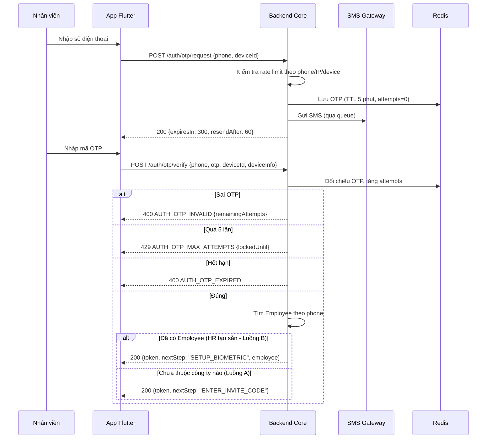
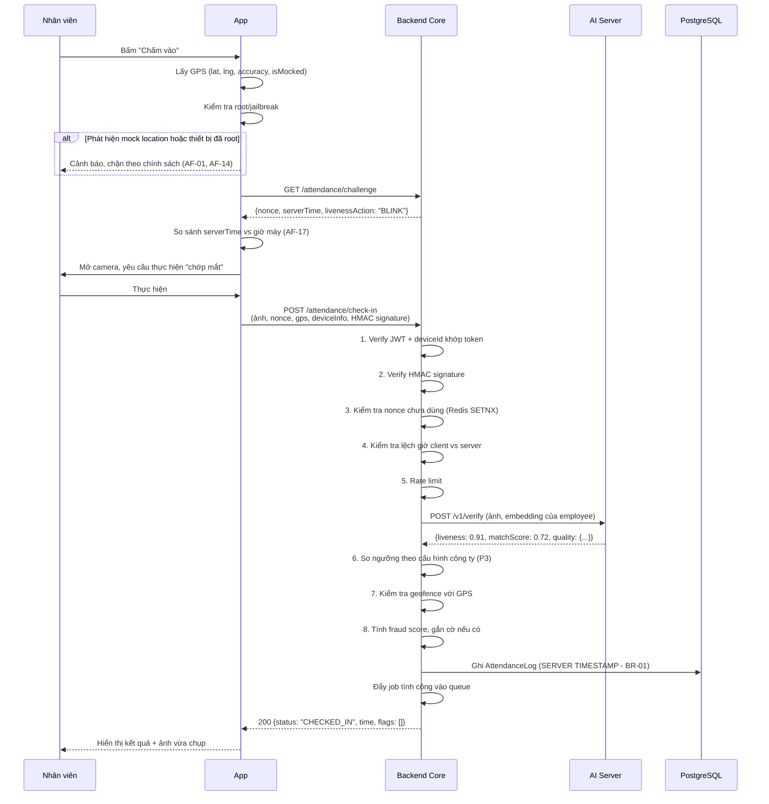

# 03 — Nghiệp vụ App Nhân viên

> Chuẩn hoá từ Chương II của tài liệu PA.
> Nền tảng: **Flutter (Dart)** — một codebase cho iOS và Android.
> Actor: `ACT-EMP` (Nhân viên).


> ⚠ **LUỒNG XÁC THỰC ĐÃ ĐỔI.** Tài liệu này còn mô tả cách đăng nhập bằng OTP và
> mã mời. Cách làm hiện tại: danh tính do **Firebase Authentication** quản lý —
> client đăng nhập với Firebase bằng **email + mật khẩu** rồi đổi ID token lấy
> phiên của Backend qua `POST /auth/session` (kèm tên miền công ty). Tài khoản do
> HR cấp sẵn, đăng nhập lần đầu bắt buộc đổi mật khẩu; xác thực 2 lớp là tuỳ chọn,
> dùng **OTP gửi qua SMS**. Mã mời và TOTP (Google Authenticator) đã bỏ hẳn.
>
> Mô tả đúng: [01 mục 9](./01-tong-quan-he-thong.md#9-cấp-tài-khoản-và-gia-nhập-công-ty) ·
> [08 mục 2](./08-hop-dong-api.md#2-api-xác-thực-auth) ·
> [13](./13-luong-onboarding-va-dang-ky-khuon-mat.md)
>
> Phần nghiệp vụ còn lại trong tài liệu này vẫn đúng.

---

## Mục lục

1. [Bản đồ màn hình](#1-bản-đồ-màn-hình)
2. [Đăng nhập & khởi tạo tài khoản](#2-đăng-nhập--khởi-tạo-tài-khoản-fr-app-auth)
3. [Đăng ký & xác thực khuôn mặt](#3-đăng-ký--xác-thực-khuôn-mặt-fr-app-face)
4. [Đăng ký & xác thực vân tay](#4-đăng-ký--xác-thực-vân-tay-fr-app-bio)
5. [Trang chủ & chấm công](#5-trang-chủ--chấm-công-fr-app-home)
6. [Đơn từ](#6-đơn-từ-fr-app-req)
7. [Lịch sử](#7-lịch-sử-fr-app-his)
8. [Cá nhân](#8-cá-nhân-fr-app-pro)
9. [Thống kê & tính năng mở rộng](#9-thống-kê--tính-năng-mở-rộng-fr-app-stat)
10. [Kiến trúc App](#10-kiến-trúc-app-flutter)

---

## 1. Bản đồ màn hình

```
Splash
  │
  ├─(đã đăng nhập)──────────────────────────────────► Home
  │
  └─(chưa đăng nhập)
        │
        ▼
   Nhập số điện thoại
        │
        ▼
   Nhập OTP ──────────────────────────────┐
        │                                  │
        ├─(tài khoản đã được HR tạo sẵn)───┤ (bỏ qua mã mời)
        │                                  │
        └─(tài khoản mới)                  │
              │                            │
              ▼                            │
        Nhập mã mời công ty ───────────────┤
                                           │
                                           ▼
                                  Thiết lập bảo mật
                              (bắt buộc ≥ 1 phương thức)
                                    │           │
                            Đăng ký mặt   Đăng ký vân tay
                                    └─────┬─────┘
                                          ▼
                                        Home

Bottom navigation:  [ Home ] [ Đơn từ ] [ Lịch sử ] [ Cá nhân ]
```

---

## 2. Đăng nhập & khởi tạo tài khoản (`FR-APP-AUTH`)

### 2.1. Danh sách yêu cầu

| Mã | Yêu cầu | Ưu tiên |
|---|---|---|
| `FR-APP-AUTH-01` | Splash screen kiểm tra trạng thái đăng nhập, điều hướng phù hợp | Must |
| `FR-APP-AUTH-02` | Nhập số điện thoại, hệ thống gửi OTP qua SMS | Must |
| `FR-APP-AUTH-03` | Nhập OTP để xác thực; giới hạn tối đa **5 lần nhập sai** | Must |
| `FR-APP-AUTH-04` | OTP hết hạn sau **3–5 phút** (cấu hình được ở Admin) | Must |
| `FR-APP-AUTH-05` | Gửi lại mã OTP, có giới hạn số lần/khoảng thời gian chống spam | Must |
| `FR-APP-AUTH-06` | Nhập mã mời công ty để tham gia đúng tổ chức | Must |
| `FR-APP-AUTH-07` | Bỏ qua bước mã mời nếu SĐT đã được HR gắn sẵn với công ty | Must |
| `FR-APP-AUTH-08` | Sinh employee code tự động ngay sau khi tham gia công ty | Must |
| `FR-APP-AUTH-09` | Bắt buộc đăng ký ≥ 1 phương thức xác thực trước khi vào Home | Must |
| `FR-APP-AUTH-10` | Một tài khoản thuộc nhiều công ty và chuyển đổi được | Should |

### 2.2. Luồng chi tiết



### 2.3. Bảng xử lý lỗi

| Tình huống | Mã lỗi | Thông điệp hiển thị | Hành động của App |
|---|---|---|---|
| Sai OTP | `AUTH_OTP_INVALID` | "Mã OTP không đúng. Bạn còn {n} lần thử." | Xoá ô nhập, giữ nguyên màn hình |
| OTP hết hạn | `AUTH_OTP_EXPIRED` | "Mã OTP đã hết hạn. Vui lòng gửi lại mã." | Bật nút "Gửi lại mã" |
| Vượt số lần thử | `AUTH_OTP_MAX_ATTEMPTS` | "Bạn đã nhập sai quá nhiều lần. Thử lại sau {t} phút." | Khoá màn hình, đếm ngược |
| Gửi lại quá nhanh | `AUTH_OTP_RESEND_TOO_SOON` | "Vui lòng đợi {t} giây trước khi gửi lại." | Hiển thị đếm ngược |
| SĐT không tồn tại / bị khoá | `AUTH_PHONE_BLOCKED` | "Số điện thoại không hợp lệ hoặc đã bị khoá. Liên hệ quản trị." | Về màn nhập SĐT |
| Mã mời không tồn tại | `INVITE_NOT_FOUND` | "Mã mời không tồn tại. Kiểm tra lại với công ty." | Giữ màn hình, focus ô nhập |
| Mã mời hết hạn | `INVITE_EXPIRED` | "Mã mời đã hết hạn. Vui lòng xin mã mới." | Giữ màn hình |
| Mã mời bị vô hiệu hoá | `INVITE_REVOKED` | "Mã mời đã bị thu hồi." | Giữ màn hình |
| Công ty tạm ngưng | `INVITE_COMPANY_SUSPENDED` | "Công ty đang tạm ngưng sử dụng dịch vụ." | Giữ màn hình |
| Đã thuộc công ty khác | `INVITE_ALREADY_MEMBER` | Tuỳ chính sách: chặn, hoặc hỏi "Bạn muốn tham gia thêm công ty này?" | Xem `Q1` |

### 2.4. Tiêu chí chấp nhận

- [ ] Nhập sai OTP lần thứ 6 bị khoá và không gọi được API verify nữa cho tới khi hết thời gian khoá.
- [ ] Gửi lại OTP trước 60 giây bị chặn ở cả client và server (client chặn để UX, server chặn để bảo mật).
- [ ] Nhân viên do HR tạo sẵn **không thấy màn nhập mã mời**.
- [ ] Employee code sinh đúng quy tắc `<viết tắt tên>.<mã công ty>`, xử lý được trùng tên.
- [ ] Không thể bỏ qua bước Thiết lập bảo mật bằng cách back hoặc kill app rồi mở lại (`BR-03`).

---

## 3. Đăng ký & xác thực khuôn mặt (`FR-APP-FACE`)

### 3.1. Luồng đăng ký (Enrollment)

```
1. Hướng dẫn: "Đưa khuôn mặt vào khung hình, giữ điện thoại ngang tầm mắt"
2. Chụp/quay video ngắn ĐA GÓC:
     - Nhìn thẳng
     - Quay đầu sang trái / sang phải
     - Chớp mắt theo yêu cầu   ← liveness, thao tác NGẪU NHIÊN mỗi lần
3. App tiền xử lý cơ bản trên máy (crop, resize) rồi gửi lên Backend
4. Backend chuyển tiếp AI Server:
     - Face detection
     - Kiểm tra chất lượng
     - Liveness / anti-spoofing
     - Trích embedding (512 chiều)
     - Đối chiếu với TOÀN BỘ embedding đã đăng ký trong công ty  ← BR-10
5. Nếu trùng với nhân viên khác → CHẶN, cảnh báo gian lận danh tính
6. Nếu hợp lệ → lưu embedding vào hồ sơ sinh trắc học của nhân viên
```

> **Nên lưu nhiều embedding cho một người** (từ nhiều góc, nhiều điều kiện ánh sáng) để tăng tỉ lệ nhận đúng. Xem `00-kien-thuc-nen-tang.md` Phần 1.

### 3.2. Danh sách yêu cầu

| Mã | Yêu cầu | Ưu tiên |
|---|---|---|
| `FR-APP-FACE-01` | Đăng ký khuôn mặt đa góc kèm liveness với thao tác ngẫu nhiên | Must |
| `FR-APP-FACE-02` | Tiền xử lý ảnh trên thiết bị trước khi gửi (giảm băng thông) | Should |
| `FR-APP-FACE-03` | Xác thực khuôn mặt khi chấm công (1:1 với hồ sơ nhân viên) | Must |
| `FR-APP-FACE-04` | Chặn đăng ký nếu khuôn mặt trùng nhân viên khác (`BR-10`) | Must |
| `FR-APP-FACE-05` | Giới hạn số lần thử, tạm khoá chức năng khi vượt ngưỡng | Must |
| `FR-APP-FACE-06` | Mỗi lỗi có mã riêng + hướng dẫn khắc phục cụ thể | Must |
| `FR-APP-FACE-07` | Ghi log mọi lần thử về hệ thống giám sát để Admin theo dõi tỉ lệ lỗi | Must |
| `FR-APP-FACE-08` | Đăng ký lại khuôn mặt yêu cầu xác thực lại danh tính trước | Must |

### 3.3. Bảng xử lý lỗi (đầy đủ theo PA 2.2)

| Tình huống | Mã lỗi | Hướng dẫn hiển thị cho người dùng |
|---|---|---|
| Không phát hiện khuôn mặt | `FACE_NOT_FOUND` | "Không thấy khuôn mặt. Đưa mặt vào giữa khung hình." |
| Nhiều khuôn mặt cùng lúc | `FACE_MULTIPLE` | "Có nhiều người trong khung hình. Vui lòng chỉ chụp một mình." |
| Ánh sáng không đủ | `FACE_LOW_LIGHT` | "Nơi bạn đứng quá tối. Di chuyển tới chỗ sáng hơn." |
| Quá chói / ngược sáng | `FACE_BACKLIT` | "Ánh sáng chiếu sau lưng. Quay lưng lại nguồn sáng." |
| Khuôn mặt bị che | `FACE_OCCLUDED` / `FACE_MASK_DETECTED` | "Vui lòng tháo khẩu trang, kính râm hoặc mũ và thử lại." |
| Nghi ngờ giả mạo | `FACE_LIVENESS_FAILED` | "Không xác nhận được người thật. Vui lòng nhìn thẳng vào camera và thử lại." |
| Ảnh mờ/nhiễu | `FACE_BLURRY` | "Ảnh bị mờ. Giữ điện thoại ổn định và thử lại." |
| Góc chụp quá nghiêng | `FACE_BAD_ANGLE` | "Nhìn thẳng vào camera, không nghiêng đầu quá nhiều." |
| Khuôn mặt quá nhỏ | `FACE_TOO_SMALL` | "Đưa điện thoại lại gần hơn." |
| Timeout / mất kết nối AI | `SYS_AI_TIMEOUT` | "Hệ thống đang bận. Vui lòng thử lại sau ít giây." |
| Trùng với nhân viên khác | `FACE_DUPLICATE_IDENTITY` | "Khuôn mặt này đã được đăng ký cho tài khoản khác. Vui lòng liên hệ quản trị viên." |
| Vượt số lần thử | `FACE_MAX_ATTEMPTS` | "Bạn đã thử quá nhiều lần. Thử lại sau {t} phút hoặc liên hệ HR." |

> **Yêu cầu thi công:** bảng mã lỗi này phải nằm ở **một nguồn duy nhất** (backend), App import và ánh xạ sang thông điệp đa ngôn ngữ. Không hard-code chuỗi tiếng Việt rải rác trong Flutter.

### 3.4. Tiêu chí chấp nhận

- [ ] Thao tác liveness (chớp mắt / quay đầu / mỉm cười) do **server chọn ngẫu nhiên** mỗi lần, App không tự quyết (`AF-05`).
- [ ] Giơ ảnh in hoặc video phát lại trên màn hình điện thoại bị từ chối với `FACE_LIVENESS_FAILED`.
- [ ] Đăng ký khuôn mặt của người đã đăng ký ở tài khoản khác bị chặn và ghi cảnh báo về Admin.
- [ ] Mỗi lần thử thất bại đều được ghi log kèm mã lỗi, gửi lên Elasticsearch.
- [ ] Thời gian từ lúc bấm chụp tới lúc có kết quả ≤ 2 giây ở điều kiện mạng bình thường.

---

## 4. Đăng ký & xác thực vân tay (`FR-APP-BIO`)

### 4.1. Nguyên tắc

Sử dụng API sinh trắc học sẵn có của hệ điều hành: **Android BiometricPrompt**, **iOS LocalAuthentication** (gói Flutter `local_auth`).

> **Ứng dụng KHÔNG lưu trữ dữ liệu vân tay thực tế** (`BR-05`). Vân tay được xác thực cục bộ trong secure enclave/keystore của thiết bị. Hệ thống chỉ nhận về một **khoá xác nhận** (cryptographic key/token) rằng thiết bị đã xác thực thành công.

### 4.2. Thiết kế chống giả mạo cho vân tay

Vì `BR-02` cấm tin cờ trạng thái từ client, không thể chỉ nhận `fingerprintOk: true`. Cơ chế đúng:

```
Lúc đăng ký:
  1. App tạo cặp khoá trong secure enclave, yêu cầu "chỉ dùng được sau khi xác thực sinh trắc học"
     (Android: setUserAuthenticationRequired(true); iOS: kSecAccessControlBiometryCurrentSet)
  2. App gửi PUBLIC KEY + device attestation lên Backend
  3. Backend lưu public key gắn với (employee, device)

Lúc chấm công bằng vân tay:
  1. Backend cấp challenge ngẫu nhiên (nonce, TTL ngắn)
  2. App yêu cầu OS xác thực vân tay → nếu OK, secure enclave mới cho ký challenge bằng private key
  3. App gửi chữ ký lên Backend
  4. Backend verify chữ ký bằng public key đã lưu
     → Ký được nghĩa là vân tay ĐÃ được xác thực thật ở tầng OS
```

Quan trọng: **khoá bị vô hiệu tự động** khi người dùng thêm/xoá vân tay ở cấp hệ điều hành (`kSecAccessControlBiometryCurrentSet` / `setInvalidatedByBiometricEnrollment`). Khi đó App phải bắt lỗi và yêu cầu đăng ký lại.

### 4.3. Danh sách yêu cầu

| Mã | Yêu cầu | Ưu tiên |
|---|---|---|
| `FR-APP-BIO-01` | Đăng ký vân tay tạo cặp khoá trong secure enclave, gửi public key lên Backend | Must |
| `FR-APP-BIO-02` | Chấm công bằng vân tay theo cơ chế challenge–response có chữ ký | Must |
| `FR-APP-BIO-03` | Phát hiện thiết bị không hỗ trợ sinh trắc học, hiển thị thông báo phù hợp | Must |
| `FR-APP-BIO-04` | Điều hướng ra Cài đặt thiết bị nếu chưa đăng ký vân tay ở cấp OS | Must |
| `FR-APP-BIO-05` | Bắt sự kiện OS khoá tạm thời khi xác thực sai nhiều lần | Must |
| `FR-APP-BIO-06` | Đổi thiết bị → yêu cầu đăng ký lại, vô hiệu hoá khoá cũ (`BR-11`) | Must |
| `FR-APP-BIO-07` | Vân tay thay đổi ở cấp OS → yêu cầu xác thực lại bằng phương thức khác | Must |

### 4.4. Bảng xử lý lỗi

| Tình huống | Mã lỗi | Xử lý |
|---|---|---|
| Thiết bị không có cảm biến | `BIO_NOT_SUPPORTED` | Ẩn tuỳ chọn vân tay, chỉ cho đăng ký khuôn mặt |
| Chưa đăng ký vân tay ở OS | `BIO_NOT_ENROLLED` | Nút "Mở Cài đặt" điều hướng thẳng tới màn hình sinh trắc học của OS |
| Xác thực sai nhiều lần | `BIO_LOCKED_OUT` | "Thiết bị đã tạm khoá vân tay. Dùng khuôn mặt hoặc thử lại sau." |
| Đổi thiết bị mới | `BIO_DEVICE_CHANGED` | Yêu cầu xác thực lại (OTP + khuôn mặt) rồi đăng ký khoá mới, thu hồi khoá cũ |
| Vân tay OS thay đổi | `BIO_KEY_INVALIDATED` | Tự động chuyển sang xác thực bằng khuôn mặt/OTP, yêu cầu đăng ký lại vân tay |

### 4.5. Tiêu chí chấp nhận

- [ ] Backend **không nhận** bất kỳ payload nào dạng `{fingerprintVerified: true}` — chỉ nhận chữ ký challenge.
- [ ] Thêm vân tay mới ở cấp OS làm khoá cũ mất hiệu lực, App bắt được và hướng dẫn đăng ký lại.
- [ ] Cài lại app trên cùng thiết bị vẫn phải đăng ký lại khoá (secure enclave key bị xoá).

---

## 5. Trang chủ & chấm công (`FR-APP-HOME`)

### 5.1. Thành phần màn hình

```
┌──────────────────────────────────────────────┐
│ [Avatar] Chào buổi sáng, Đức    ☁ 28°C  🔔 3 │
├──────────────────────────────────────────────┤
│ Thứ Hai, 03/08/2026 · Ca hành chính 08:00-17:30│
├──────────────────────────────────────────────┤
│  ┌────────────────────────────────────────┐  │
│  │  ĐÃ CHẤM VÀO  08:02                    │  │
│  │  ⏱ 02:34:11  (đang tính giờ)           │  │
│  │  📍 Cách văn phòng 45m  ✓ Trong vùng   │  │
│  │                                         │  │
│  │      [  CHẤM RA  ]  🔒 mặt / vân tay   │  │
│  └────────────────────────────────────────┘  │
├──────────────────────────────────────────────┤
│ [Xin ra ngoài] [Tạo đơn] [Công tháng] [Lịch ca]│
├──────────────────────────────────────────────┤
│ ⏳ Bạn có 1 đơn đang chờ duyệt        →      │
├──────────────────────────────────────────────┤
│ Lịch tuần:  T2  T3  T4  T5  T6  T7  CN       │
│             ✓   ✓   ●   -   -   ○   ○        │
├──────────────────────────────────────────────┤
│ Công tháng 8:  128h 30p  ·  Đi muộn: 2 lần   │
│ Phép còn lại: 8.5 ngày   ·  OT duyệt: 12h    │
├──────────────────────────────────────────────┤
│ 🎉 Còn 30 ngày tới Quốc khánh 02/09          │
└──────────────────────────────────────────────┘
```

### 5.2. Danh sách yêu cầu

| Mã | Yêu cầu | Ưu tiên |
|---|---|---|
| `FR-APP-HOME-01` | Hiển thị avatar, tên, lời chào theo thời điểm trong ngày | Should |
| `FR-APP-HOME-02` | Thời tiết theo vị trí hiện tại, số thông báo chưa đọc | Could |
| `FR-APP-HOME-03` | Hiển thị ca làm việc hôm nay và ngày trong tuần | Must |
| `FR-APP-HOME-04` | Trạng thái chấm công realtime + đồng hồ đếm thời gian | Must |
| `FR-APP-HOME-05` | Hiển thị GPS & khoảng cách tới văn phòng, trạng thái geofence | Must |
| `FR-APP-HOME-06` | Nút Chấm vào / Chấm ra bằng khuôn mặt hoặc vân tay | Must |
| `FR-APP-HOME-07` | Cảnh báo hoặc chặn chấm công khi ngoài vùng (tuỳ chính sách, có ngoại lệ cho nhân viên công tác) | Must |
| `FR-APP-HOME-08` | Lối tắt: Xin ra ngoài, Tạo đơn, Công tháng, Lịch ca | Should |
| `FR-APP-HOME-09` | Banner đơn đang chờ duyệt, bấm vào xem chi tiết | Should |
| `FR-APP-HOME-10` | Lịch làm việc tuần dạng dải ngày, biểu tượng trạng thái từng ngày | Should |
| `FR-APP-HOME-11` | Khối tổng hợp công tháng: tổng giờ làm, số lần đi muộn | Should |
| `FR-APP-HOME-12` | Phép năm còn lại, số giờ OT đã duyệt | Should |
| `FR-APP-HOME-13` | Đếm ngược ngày nghỉ lễ sắp tới | Could |

### 5.3. Luồng chấm công — luồng nghiệp vụ quan trọng nhất



### 5.4. Quy tắc chấm công

| Mã | Quy tắc |
|---|---|
| `BR-ATT-01` | Một ngày có thể có nhiều cặp vào/ra (ra ngoài giữa giờ). Hệ thống xác định IN/OUT theo trạng thái hiện tại, không theo giả định "lần 1 là vào". |
| `BR-ATT-02` | Đã chấm vào rồi chấm vào tiếp → trả `ATT_ALREADY_CHECKED_IN`, gợi ý "Bạn có muốn chấm ra?" |
| `BR-ATT-03` | Chưa chấm vào mà chấm ra → cho phép nhưng gắn cờ thiếu bản ghi vào, yêu cầu tạo đơn Bổ sung công. |
| `BR-ATT-04` | Không có ca làm việc hôm nay → `ATT_NO_SHIFT_TODAY`, trừ khi công ty bật chế độ ca linh hoạt. |
| `BR-ATT-05` | Kỳ lương đã chốt → không cho chấm công bổ sung vào kỳ đó (`ATT_PERIOD_LOCKED`). |
| `BR-ATT-06` | Ngoài vùng geofence: **chặn** hoặc **cho chấm nhưng gắn cờ chờ duyệt**, tuỳ cấu hình công ty. Nhân viên có đơn công tác đã duyệt được miễn kiểm tra geofence. |
| `BR-ATT-07` | Mọi lượt chấm công đều lưu: ảnh (nếu bằng mặt), toạ độ, độ chính xác GPS, nguồn cấp vị trí, thiết bị, IP, kết quả AI kèm confidence score. |

### 5.5. Tiêu chí chấp nhận

- [ ] Chỉnh giờ điện thoại lùi 2 giờ vẫn ghi nhận đúng giờ server, đồng thời gắn cờ `FRAUD_CLOCK_SKEW`.
- [ ] Bật app fake GPS → bị chặn với `FRAUD_MOCK_LOCATION`.
- [ ] Gửi lại y nguyên một request chấm công đã thành công → bị từ chối `FRAUD_REPLAY_DETECTED`.
- [ ] Gọi thẳng API bằng curl với token hợp lệ nhưng không có ảnh hợp lệ → không chấm công được (`BR-02`).
- [ ] Đứng cách văn phòng 500m (bán kính cho phép 100m) → chặn hoặc gắn cờ theo cấu hình.
- [ ] Đồng hồ đếm giờ trên Home khớp với thời gian server, không lệch khi đổi múi giờ máy.

---

## 6. Đơn từ (`FR-APP-REQ`)

### 6.1. Danh mục loại đơn

| Loại đơn | Mô tả | Trừ vào | Đính kèm | Giai đoạn |
|---|---|---|---|---|
| **Xin nghỉ phép** | Nghỉ có sử dụng phép năm, theo ngày/nửa ngày | Phép năm | Không | MVP |
| **Xin ra ngoài** | Ra ngoài trong giờ làm, có giờ đi/về dự kiến | Không trừ (theo dõi thời lượng) | Không | MVP |
| **Về sớm** | Kết thúc ca sớm hơn quy định | Giờ công thiếu / phép nếu áp dụng | Không | GĐ 2 |
| **Làm bù** | Đăng ký làm bù cho ca thiếu/đi muộn trước đó | Cộng bù giờ công | Không | GĐ 2 |
| **Nghỉ không lương** | Nghỉ không dùng phép năm, không tính lương | Ngày công (không lương) | Không | GĐ 2 |
| **Công tác** | Đi công tác ngoài văn phòng, vẫn tính công | Không trừ | **Bắt buộc** minh chứng | GĐ 2 |
| **Nghỉ ốm / thai sản** | Chính sách riêng theo luật lao động | Theo chính sách BHXH | **Bắt buộc** giấy tờ y tế | GĐ 2 |
| **Bổ sung công** | Xin điều chỉnh khi quên chấm công / chấm lỗi | Không trừ | **Bắt buộc** minh chứng | GĐ 2 |
| **Đổi ca / chuyển ca** | Đổi ca với đồng nghiệp hoặc theo lịch | Không trừ | Không | GĐ 2 |
| **Đăng ký OT trước** | Đăng ký làm thêm giờ, duyệt trước khi tính OT | Cộng giờ OT | Không | GĐ 2 |

### 6.2. Luồng tạo đơn

```
Chọn loại đơn
  ▼
Chọn khoảng thời gian (ngày / giờ cụ thể tuỳ loại đơn)
  ▼
Nhập lý do (giới hạn ký tự, ví dụ 500)
  ▼
Hệ thống hiển thị THÔNG TIN THAM CHIẾU:
    - Số phép năm còn lại
    - Giờ nợ / giờ dư hiện tại
    - Cảnh báo nếu vượt quá số phép còn lại
  ▼
Đính kèm file/hình (nếu loại đơn yêu cầu)
  ▼
[Lưu nháp]  hoặc  [Gửi đơn]
  ▼
Đơn đi tới người duyệt theo cấu hình
(1 cấp hoặc nhiều cấp, ví dụ: Quản lý trực tiếp → HR)
```

### 6.3. Vòng đời trạng thái đơn

```
        ┌──────┐  gửi   ┌────────────┐  duyệt hết cấp  ┌──────────┐
        │ NHÁP │───────►│ CHỜ DUYỆT  │────────────────►│ ĐÃ DUYỆT │
        └──────┘        └─────┬──────┘                 └────┬─────┘
                              │                             │
                     từ chối  │                     huỷ (nếu chính sách
                    (kèm lý do)│                      cho phép & chưa tới
                              ▼                       ngày áp dụng)
                        ┌──────────┐                      │
                        │ TỪ CHỐI  │                      ▼
                        └──────────┘                 ┌─────────┐
                              ▲                      │ ĐÃ HUỶ  │
                    nhân viên │                      └─────────┘
                    tự huỷ    │
                        ┌─────┴────┐
                        │ ĐÃ HUỶ   │
                        └──────────┘
```

Với luồng duyệt nhiều cấp, `CHỜ DUYỆT` có trạng thái con theo từng `ApprovalStep`: `PENDING_LEVEL_1`, `PENDING_LEVEL_2`…

### 6.4. Danh sách yêu cầu

| Mã | Yêu cầu | Ưu tiên |
|---|---|---|
| `FR-APP-REQ-01` | Tạo đơn theo từng loại với form phù hợp | Must |
| `FR-APP-REQ-02` | Hiển thị thông tin tham chiếu (phép còn lại, giờ nợ/dư) trước khi gửi | Must |
| `FR-APP-REQ-03` | Lưu nháp và gửi sau | Should |
| `FR-APP-REQ-04` | Theo dõi trạng thái đơn, xem lý do từ chối | Must |
| `FR-APP-REQ-05` | Huỷ đơn khi chưa được duyệt | Must |
| `FR-APP-REQ-06` | Huỷ đơn đã duyệt nhưng chưa tới ngày áp dụng (tuỳ chính sách) | Should |
| `FR-APP-REQ-07` | Push notification khi đơn được duyệt/từ chối | Must |
| `FR-APP-REQ-08` | Đính kèm file/hình minh chứng cho các loại đơn yêu cầu | Must |
| `FR-APP-REQ-09` | Chặn tạo đơn trùng khoảng thời gian với đơn đã có | Must |
| `FR-APP-REQ-10` | Chặn tạo đơn nghỉ phép vượt số phép còn lại (hoặc cảnh báo tuỳ chính sách) | Must |

### 6.5. Quy tắc nghiệp vụ đơn từ

| Mã | Quy tắc |
|---|---|
| `BR-REQ-01` | Đơn nghỉ phép trừ vào số dư phép năm **tại thời điểm được duyệt**, không phải lúc gửi. |
| `BR-REQ-02` | Không cho tạo đơn chồng lấn khoảng thời gian với đơn đang chờ duyệt hoặc đã duyệt (`REQ_OVERLAP`). |
| `BR-REQ-03` | Đơn được duyệt cho **ngày trong quá khứ** vẫn hợp lệ và **kích hoạt tính lại công** của khoảng đó (`ADR-08`). |
| `BR-REQ-04` | Đơn duyệt vào kỳ lương đã chốt bị chặn, cần Kế toán mở lại kỳ (`BR-07`). |
| `BR-REQ-05` | Loại đơn yêu cầu minh chứng mà không có file đính kèm → không cho gửi (`REQ_ATTACHMENT_REQUIRED`). |
| `BR-REQ-06` | File đính kèm giới hạn dung lượng và định dạng (jpg/png/pdf, ≤ 10MB/file, ≤ 5 file/đơn). |

### 6.6. Tiêu chí chấp nhận

- [ ] Tạo đơn nghỉ 3 ngày khi chỉ còn 2 ngày phép → bị chặn hoặc cảnh báo rõ ràng theo cấu hình.
- [ ] Đơn nghỉ đã duyệt cho ngày hôm qua làm bảng công ngày đó được tính lại đúng.
- [ ] Nhân viên nhận push notification trong vòng 10 giây sau khi quản lý duyệt đơn.
- [ ] Không tạo được 2 đơn nghỉ chồng ngày.

---

## 7. Lịch sử (`FR-APP-HIS`)

### 7.1. Danh sách yêu cầu

| Mã | Yêu cầu | Ưu tiên |
|---|---|---|
| `FR-APP-HIS-01` | Tổng kết theo tháng: tổng giờ làm, giờ OT, giờ làm bù | Must |
| `FR-APP-HIS-02` | Bộ lọc nhanh: Tháng này, Tuần này, Chờ duyệt | Must |
| `FR-APP-HIS-03` | Bộ lọc nâng cao: chọn khoảng ngày tuỳ ý | Should |
| `FR-APP-HIS-04` | Danh sách chấm công theo ngày: giờ vào/ra, tổng thời gian, trạng thái | Must |
| `FR-APP-HIS-05` | Xem chi tiết một lượt chấm công: ảnh, GPS, phương thức xác thực | Must |
| `FR-APP-HIS-06` | Gửi yêu cầu bổ sung/chỉnh sửa công (liên kết đơn "Bổ sung công") | Must |
| `FR-APP-HIS-07` | Biểu đồ xu hướng chuyên cần theo tuần/tháng | Should |

### 7.2. Trạng thái ngày công

| Trạng thái | Điều kiện |
|---|---|
| **Đúng giờ** | Chấm vào trong khoảng cho phép, chấm ra đủ giờ ca |
| **Đi muộn** | Chấm vào sau giờ ca + số phút trễ cho phép |
| **Về sớm** | Chấm ra trước giờ kết thúc ca |
| **Đang tăng ca** | Đang trong ca OT đã được duyệt |
| **Thiếu công** | Tổng giờ làm nhỏ hơn giờ ca chuẩn, không có đơn hợp lệ |
| **Nghỉ phép** | Có đơn nghỉ phép đã duyệt |
| **Nghỉ lễ** | Ngày nằm trong danh mục ngày lễ của công ty |
| **Thiếu bản ghi** | Có chấm vào mà không có chấm ra (hoặc ngược lại) |

### 7.3. Tiêu chí chấp nhận

- [ ] Xem chi tiết một lượt chấm công hiển thị đúng ảnh đã chụp và vị trí trên bản đồ.
- [ ] Ảnh chấm công chỉ nhân viên đó và người có quyền (Quản lý phòng ban, HR, Admin) xem được, qua presigned URL có thời hạn ngắn.
- [ ] Bấm "Yêu cầu bổ sung công" từ một ngày thiếu công tạo sẵn đơn với ngày và ngữ cảnh đã điền.

---

## 8. Cá nhân (`FR-APP-PRO`)

| Mã | Yêu cầu | Ưu tiên |
|---|---|---|
| `FR-APP-PRO-01` | Xem thông tin cá nhân: họ tên, chức vụ, phòng ban, mã nhân viên, ngày vào làm, SĐT | Must |
| `FR-APP-PRO-02` | Đổi/thiết lập lại khuôn mặt và vân tay — **bắt buộc xác thực lại danh tính trước** | Must |
| `FR-APP-PRO-03` | Cài đặt thông báo: bật/tắt theo từng loại | Should |
| `FR-APP-PRO-04` | Chế độ giao diện Sáng/Tối | Could |
| `FR-APP-PRO-05` | Đa ngôn ngữ (Tiếng Việt / Tiếng Anh) | Could |
| `FR-APP-PRO-06` | Chuyển đổi công ty (nếu tài khoản thuộc nhiều công ty) | Should |
| `FR-APP-PRO-07` | Xem điều khoản sử dụng, chính sách bảo mật dữ liệu sinh trắc học | Must |
| `FR-APP-PRO-08` | Đăng xuất | Must |
| `FR-APP-PRO-09` | Yêu cầu xoá tài khoản (quyền được quên) | Must |

### 8.1. Luồng đổi khuôn mặt/vân tay (nhạy cảm)

```
Bấm "Đăng ký lại khuôn mặt"
  ▼
BẮT BUỘC xác thực lại danh tính:
   - Nhập OTP gửi tới SĐT đã đăng ký, HOẶC
   - Xác thực bằng phương thức sinh trắc học còn lại
  ▼
Tuỳ chính sách công ty: cần HR/Admin phê duyệt
  ▼
Thực hiện đăng ký mới (luồng như mục 3)
  ▼
Vô hiệu hoá embedding cũ, ghi AUDIT LOG (BR-08)
  ▼
Gửi thông báo tới HR: "Nhân viên X đã đổi dữ liệu sinh trắc học lúc Y"
```

> Đây là điểm tấn công quan trọng: nếu ai đó chiếm được điện thoại đang đăng nhập, họ có thể đăng ký khuôn mặt của mình đè lên. Vì vậy bắt buộc xác thực lại và luôn có audit + thông báo cho HR.

### 8.2. Luồng yêu cầu xoá tài khoản

```
Nhân viên gửi yêu cầu xoá tài khoản
  ▼
Xác thực lại danh tính (OTP)
  ▼
Hệ thống tạo yêu cầu, thông báo HR/Admin công ty
  ▼
Sau thời gian chờ (ví dụ 30 ngày, cấu hình được):
   - XOÁ: embedding khuôn mặt, khoá sinh trắc học, ảnh chấm công, thông tin cá nhân
   - GIỮ (ẩn danh hoá): bản ghi chấm công và bảng công đã chốt
     → phục vụ nghĩa vụ lưu trữ chứng từ lương của doanh nghiệp
  ▼
Ghi audit log, gửi xác nhận cho người dùng
```

---

## 9. Thống kê & tính năng mở rộng (`FR-APP-STAT`)

| Mã | Yêu cầu | Ưu tiên | Giai đoạn |
|---|---|---|---|
| `FR-APP-STAT-01` | Thống kê đơn từ: số lượng theo loại, tỷ lệ duyệt/từ chối theo tháng/quý/năm, biểu đồ tròn/cột | Should | GĐ 2 |
| `FR-APP-STAT-02` | Thống kê chuyên cần: biểu đồ đi muộn/về sớm theo tháng, so sánh tháng trước, xu hướng | Should | GĐ 2 |
| `FR-APP-STAT-03` | Cảnh báo cá nhân: sắp hết hạn phép năm, nguy cơ âm công cuối tháng, sắp tới hạn làm bù | Should | GĐ 2 |
| `FR-APP-STAT-04` | Nhắc lịch: nhắc chấm vào/ra nếu tới giờ chưa chấm, nhắc duyệt đơn, nhắc ngày lễ | Should | GĐ 2 |
| `FR-APP-STAT-05` | Widget chấm công nhanh trên màn hình khoá | Could | GĐ 3 |
| `FR-APP-STAT-06` | Chế độ offline: chấm công khi mất mạng, đồng bộ khi có kết nối | Could | GĐ 3 |

### 9.1. Lưu ý thi công chế độ offline (`FR-APP-STAT-06`)

Chế độ offline **mâu thuẫn trực tiếp với `BR-01`** (giờ server là chuẩn). Thiết kế bắt buộc:

```
Khi offline:
  - Lưu bản ghi cục bộ (Hive/SQLite): ảnh, timestamp cục bộ, GPS, device info
  - ĐÁNH DẤU rõ ràng: source = "OFFLINE"

Khi có kết nối trở lại:
  - Đồng bộ lên server
  - Server ghi nhận với cờ `isOffline = true` và `pendingReview = true`
  - Lệch giữa timestamp cục bộ và thời điểm đồng bộ phải nằm trong ngưỡng hợp lý
  - Bản ghi offline KHÔNG tự động vào bảng công — cần Quản lý/HR duyệt
```

Không có cách nào tin tuyệt đối một bản ghi offline. Chấp nhận đánh đổi: tiện lợi ↔ độ tin cậy, và bù bằng quy trình duyệt.

---

## 10. Kiến trúc App Flutter

### 10.1. Cấu trúc thư mục

```
mobile/
├── lib/
│   ├── main.dart
│   ├── app.dart
│   ├── core/
│   │   ├── network/          # Dio client, interceptor (token, retry, HMAC ký request)
│   │   ├── storage/          # flutter_secure_storage, Hive box
│   │   ├── security/         # SSL pinning, root detection, app attestation
│   │   ├── error/            # ánh xạ error code → thông điệp đa ngôn ngữ
│   │   ├── location/         # geolocator wrapper, mock detection
│   │   └── di/               # get_it service locator
│   ├── features/
│   │   ├── auth/
│   │   │   ├── data/         # datasource, repository impl, model
│   │   │   ├── domain/       # entity, usecase, repository interface
│   │   │   └── presentation/ # bloc, page, widget
│   │   ├── biometric/
│   │   ├── attendance/
│   │   ├── request/
│   │   ├── history/
│   │   ├── profile/
│   │   └── notification/
│   ├── shared/
│   │   ├── widgets/
│   │   └── theme/
│   └── l10n/                 # vi.arb, en.arb
└── pubspec.yaml
```

### 10.2. Thư viện chính (theo PA 7.2)

| Mục đích | Gói |
|---|---|
| State management | `flutter_bloc` (Bloc) — khuyến nghị cho nghiệp vụ nhiều luồng phức tạp |
| Networking | `dio` + interceptor gắn token, retry, xử lý lỗi tập trung |
| Lưu trữ offline | `hive` hoặc `sqflite` |
| Lưu trữ nhạy cảm | `flutter_secure_storage` |
| Camera | `camera` + xử lý crop/resize trên thiết bị |
| Sinh trắc học cục bộ | `local_auth` |
| Định vị | `geolocator` (lấy GPS + phát hiện mock location) |
| Bản đồ | `google_maps_flutter` |
| Push notification | `firebase_messaging` (FCM) |
| SSL Pinning | `http_certificate_pinning` |
| Root/Jailbreak detection | `flutter_jailbreak_detection` |
| App Attestation | Play Integrity API (Android) / App Attest (iOS) — qua platform channel |

### 10.3. Nguyên tắc code

- Kiến trúc **Clean Architecture 3 lớp** (`data` / `domain` / `presentation`) cho mỗi feature — tách business logic khỏi UI, dễ test.
- **Không có logic nghiệp vụ trong widget.** Widget chỉ dựng UI từ state.
- **Không tin dữ liệu cục bộ** cho các quyết định nghiệp vụ — mọi kết quả chấm công đều do server trả về.
- Mọi chuỗi hiển thị đi qua `l10n`, không hard-code tiếng Việt trong widget.
- Ảnh khuôn mặt **không bao giờ lưu vĩnh viễn trên thiết bị** — chỉ giữ trong bộ nhớ tạm cho tới khi upload xong.

---

**Tiếp theo:** [04 — Nghiệp vụ Web Quản lý](./04-nghiep-vu-web-quan-ly.md)
