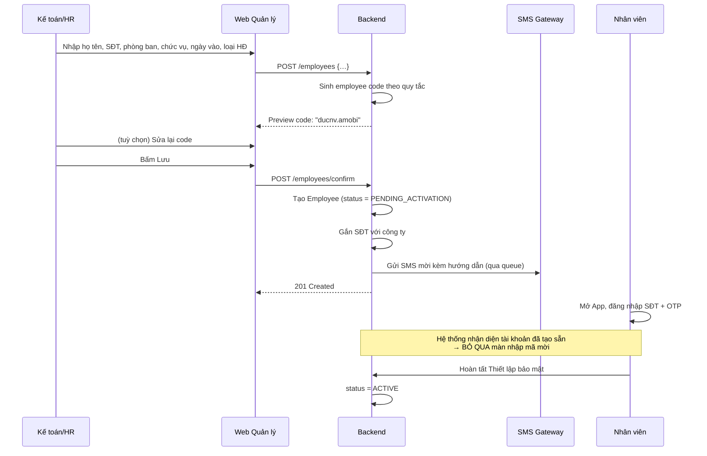

# 04 — Nghiệp vụ Web Quản lý (Quản lý / Kế toán / HR)

> Chuẩn hoá từ Chương III của tài liệu PA.
> Nền tảng: **ReactJS (TypeScript) + Vite + Ant Design/MUI** — dùng chung codebase với Web Admin, phân quyền hiển thị module theo vai trò (`ADR-03`).
> Actor: `ACT-MGR` (Quản lý), `ACT-HR` (Kế toán/HR), `ACT-CADM` (Admin công ty).


> ⚠ **LUỒNG XÁC THỰC ĐÃ ĐỔI.** Tài liệu này còn mô tả cách đăng nhập bằng OTP và
> mã mời. Cách làm hiện tại: danh tính do **Firebase Authentication** quản lý —
> client đăng nhập với Firebase bằng **email + mật khẩu** rồi đổi ID token lấy
> phiên của Backend qua `POST /auth/session` (kèm tên miền công ty). Tài khoản do
> HR cấp sẵn, đăng nhập lần đầu bắt buộc đổi mật khẩu; xác thực 2 lớp là tuỳ chọn,
> dùng **OTP gửi qua SMS**. Mã mời và TOTP (Google Authenticator) đã bỏ hẳn.
>
> Mô tả đúng: [01 mục 9](./01-tong-quan-he-thong.md#9-cấp-tài-khoản-và-gia-nhập-công-ty) ·
> [08 mục 2](./08-hop-dong-api.md#2-api-xác-thực-auth) ·
> [13](./13-luong-onboarding-va-dang-ky-khuon-mat.md)
>
> Phần nghiệp vụ còn lại trong tài liệu này vẫn đúng.

---

## Mục lục

1. [Ma trận phân quyền](#1-ma-trận-phân-quyền)
2. [Dashboard tổng quan](#2-dashboard-tổng-quan-fr-web-dash)
3. [Quản lý chấm công](#3-quản-lý-chấm-công-fr-web-att)
4. [Quản lý & duyệt đơn từ](#4-quản-lý--duyệt-đơn-từ-fr-web-req)
5. [Công làm bù & quy tắc tính công](#5-công-làm-bù--quy-tắc-tính-công-fr-web-mkup)
6. [Cấu hình chính sách công ty](#6-cấu-hình-chính-sách-công-ty-fr-web-pol)
7. [Tính công – Tính lương & báo cáo](#7-tính-công--tính-lương--xuất-báo-cáo-fr-web-pay)
8. [Quản lý nhân sự](#8-quản-lý-nhân-sự-fr-web-hr)
9. [Báo cáo & thống kê](#9-báo-cáo--thống-kê-fr-web-rep)
10. [Thông báo & phân quyền nội bộ](#10-thông-báo--phân-quyền-nội-bộ-fr-web-not)
11. [Mã mời & thiết bị](#11-mã-mời--thiết-bị-fr-web-inv)
12. [Kiến trúc Web](#12-kiến-trúc-web-react)

---

## 1. Ma trận phân quyền

Bảng phân quyền theo PA mục 3.9, mở rộng chi tiết theo module để thi công `RolesGuard` + `ScopeGuard`.

| Module / Hành động | Admin hệ thống | Admin công ty | Quản lý | Kế toán / HR | Nhân viên |
|---|:---:|:---:|:---:|:---:|:---:|
| **Phạm vi dữ liệu** | Mọi tenant | 1 công ty | Phòng ban mình quản lý | Toàn công ty (số liệu) | Cá nhân |
| Dashboard công ty | ✓ | ✓ | Phòng ban | ✓ | ✗ |
| Xem chấm công | ✓ | ✓ | Phòng ban | ✓ | Cá nhân |
| Xem ảnh/GPS lượt chấm công | ✓ | ✓ | Phòng ban | ✓ | Cá nhân |
| Sửa/bổ sung công thủ công | ✓ | ✓ | ✗ | ✓ | ✗ |
| Duyệt đơn từ | ✓ | ✓ | Phòng ban | Theo cấu hình | ✗ |
| Cấu hình chính sách công ty | ✓ | ✓ | ✗ | ✗ | ✗ |
| Cấu hình quy tắc tính công/OT | ✓ | ✓ | ✗ | ✓ | ✗ |
| Tính công / tính lương | ✓ | ✗ | ✗ | ✓ | ✗ |
| Chốt / mở lại kỳ lương | ✓ | ✓ | ✗ | ✓ | ✗ |
| Xuất Excel bảng công | ✓ | ✓ | Phòng ban | ✓ | ✗ |
| Tạo/sửa hồ sơ nhân viên | ✓ | ✓ | ✗ | ✓ | ✗ |
| Import nhân viên hàng loạt | ✓ | ✓ | ✗ | ✓ | ✗ |
| Xếp ca / phân ca | ✓ | ✓ | Phòng ban | ✓ | ✗ |
| Quản lý mã mời | ✓ | ✓ | ✗ | ✓ | ✗ |
| Phân quyền nội bộ | ✓ | ✓ | ✗ | ✗ | ✗ |
| Gửi thông báo công ty | ✓ | ✓ | Phòng ban | ✓ | ✗ |
| Xem dashboard cảnh báo gian lận | ✓ | ✓ | Phòng ban | ✓ | ✗ |
| Quyết định huỷ/giữ công nghi vấn | ✓ | ✓ | ✗ | ✓ | ✗ |
| Reset sinh trắc học | ✓ | ✓ | ✗ | ✓ | ✗ |
| Xem audit log công ty | ✓ | ✓ | ✗ | ✓ | ✗ |

> **Lưu ý thi công:** `Quản lý` bị giới hạn **hai chiều** — vừa theo vai trò, vừa theo phòng ban được phân công. Cần `ScopeGuard` riêng lấy danh sách `departmentId` mà user quản lý và chèn vào mọi query.

---

## 2. Dashboard tổng quan (`FR-WEB-DASH`)

| Mã | Yêu cầu | Ưu tiên |
|---|---|---|
| `FR-WEB-DASH-01` | Số nhân viên đang làm việc / đã chấm công hôm nay | Must |
| `FR-WEB-DASH-02` | Số nhân viên đi muộn hôm nay | Must |
| `FR-WEB-DASH-03` | Số đơn đang chờ duyệt (có link đi thẳng tới danh sách) | Must |
| `FR-WEB-DASH-04` | Tổng giờ OT phát sinh trong tháng | Should |
| `FR-WEB-DASH-05` | Cảnh báo bất thường: chấm công ngoài vùng, chấm công lúc bất thường | Must |
| `FR-WEB-DASH-06` | Biểu đồ chuyên cần toàn công ty theo phòng ban | Should |

### 2.1. Bố cục

```
┌──────────────────────────────────────────────────────────────────┐
│  Dashboard · Công ty AMOBI · 03/08/2026            [Đổi phòng ban▾]│
├──────────────┬──────────────┬──────────────┬─────────────────────┤
│ Đang làm việc│ Đã chấm công │  Đi muộn     │  Đơn chờ duyệt      │
│    142/168   │   156/168    │     8        │      12  →          │
├──────────────┴──────────────┴──────────────┴─────────────────────┤
│  ⚠ CẢNH BÁO BẤT THƯỜNG (5)                                →      │
│  • 2 lượt chấm công ngoài vùng cho phép                          │
│  • 1 lượt nghi ngờ vị trí giả (mock GPS)                         │
│  • 1 lượt liveness score thấp bất thường                         │
│  • 1 tài khoản chấm công trên 2 thiết bị trong 5 phút            │
├──────────────────────────────────────────────────────────────────┤
│  Chuyên cần theo phòng ban (tháng 8)      │  OT tháng 8          │
│  [Biểu đồ cột: Đúng giờ / Đi muộn / Nghỉ] │  [Biểu đồ đường]     │
└──────────────────────────────────────────────────────────────────┘
```

### 2.2. Yêu cầu hiệu năng

- Dashboard là màn hình được mở nhiều nhất → **bắt buộc cache** kết quả tổng hợp trong Redis (TTL 1–5 phút), không query trực tiếp bảng chấm công mỗi lần tải.
- Số liệu realtime (đã chấm công hôm nay) cập nhật qua WebSocket hoặc polling nhẹ, không reload cả trang.

---

## 3. Quản lý chấm công (`FR-WEB-ATT`)

| Mã | Yêu cầu | Ưu tiên |
|---|---|---|
| `FR-WEB-ATT-01` | Danh sách chấm công theo phòng ban, theo ngày/tuần/tháng | Must |
| `FR-WEB-ATT-02` | Tìm kiếm theo nhân viên (tên, mã nhân viên, SĐT) | Must |
| `FR-WEB-ATT-03` | Xem chi tiết từng lượt: ảnh, vị trí trên bản đồ, phương thức xác thực, confidence score | Must |
| `FR-WEB-ATT-04` | Chỉnh sửa/bổ sung công thủ công, **bắt buộc nhập lý do**, ghi log người chỉnh sửa | Must |
| `FR-WEB-ATT-05` | Xuất danh sách chấm công ra Excel/PDF theo bộ lọc tuỳ chọn | Must |
| `FR-WEB-ATT-06` | Hiển thị cờ nghi vấn gian lận trên từng dòng | Must |
| `FR-WEB-ATT-07` | Chặn sửa dữ liệu thuộc kỳ lương đã chốt (`BR-07`) | Must |

### 3.1. Màn hình danh sách

```
Bộ lọc: [Phòng ban ▾] [Khoảng ngày] [Trạng thái ▾] [Có cờ nghi vấn ☐] [Tìm nhân viên...]

┌────────────┬──────────┬───────┬───────┬────────┬──────────┬──────┬────────┐
│ Nhân viên  │ Mã NV    │ Ngày  │ Vào   │ Ra     │ Tổng giờ │ T.thái│ Cờ    │
├────────────┼──────────┼───────┼───────┼────────┼──────────┼──────┼────────┤
│ Nguyễn V.Đ │ducnv.amo │ 03/08 │ 08:02 │ 17:35  │ 8h33     │ ✓    │        │
│ Trần T.M   │mattt.amo │ 03/08 │ 08:47 │ 17:30  │ 7h43     │ Muộn │        │
│ Lê V.H     │hulv.amo  │ 03/08 │ 07:58 │ —      │ —        │Thiếu │        │
│ Phạm T.A   │anpt.amo  │ 03/08 │ 08:05 │ 17:32  │ 8h27     │ ✓    │ 🚩 GPS │
└────────────┴──────────┴───────┴───────┴────────┴──────────┴──────┴────────┘
                                                     [Xuất Excel] [Xuất PDF]
```

### 3.2. Màn hình chi tiết một lượt chấm công

```
┌─────────────────────────────────────────────────────────────────┐
│  Chi tiết chấm công · Phạm Thị An (anpt.amobi)                   │
├────────────────────────────┬────────────────────────────────────┤
│  [Ảnh chụp lúc chấm công]  │  Thời gian (giờ server): 08:05:12  │
│                            │  Giờ thiết bị gửi lên:   08:05:09  │
│  [Ảnh hồ sơ gốc]           │  Lệch: 3 giây  ✓                   │
│                            │                                     │
│  Điểm tương đồng: 0.71 ✓   │  Phương thức: Khuôn mặt            │
│  Liveness score:  0.88 ✓   │  Thiết bị: iPhone 14 · ID a3f9...  │
│                            │  IP: 113.161.x.x                    │
├────────────────────────────┤  Nguồn vị trí: GPS · Mock: KHÔNG   │
│  [Bản đồ hiển thị vị trí]  │  Độ chính xác: 8m                  │
│  Cách văn phòng: 340m      │                                     │
│  🚩 NGOÀI VÙNG (bán kính   │                                     │
│     cho phép 100m)         │                                     │
├────────────────────────────┴────────────────────────────────────┤
│  🚩 CỜ NGHI VẤN: ATT_OUT_OF_GEOFENCE                             │
│  Quyết định:  [ Giữ nguyên công ]  [ Huỷ công này ]              │
│  Lý do (bắt buộc): [________________________________]            │
└─────────────────────────────────────────────────────────────────┘
```

### 3.3. Quy tắc hiệu chỉnh công thủ công

| Mã | Quy tắc |
|---|---|
| `BR-ADJ-01` | **Không sửa đè bản ghi thô** (`BR-06`). Hiệu chỉnh tạo bản ghi `AttendanceAdjustment` riêng, trỏ về bản ghi gốc. |
| `BR-ADJ-02` | Bắt buộc nhập lý do hiệu chỉnh, tối thiểu 10 ký tự. |
| `BR-ADJ-03` | Ghi audit log: ai sửa, sửa gì (giá trị cũ → giá trị mới), thời điểm, lý do (`BR-08`). |
| `BR-ADJ-04` | Sau khi hiệu chỉnh, tự động kích hoạt tính lại `AttendanceDaily` của ngày đó. |
| `BR-ADJ-05` | Không cho hiệu chỉnh dữ liệu thuộc kỳ lương đã chốt. Muốn sửa phải mở lại kỳ (thao tác riêng, có log). |
| `BR-ADJ-06` | Nhân viên xem được lịch sử hiệu chỉnh liên quan tới mình (minh bạch, giảm khiếu nại). |

### 3.4. Tiêu chí chấp nhận

- [ ] Quản lý phòng ban A không xem được chấm công của phòng ban B.
- [ ] Sửa giờ vào từ 08:47 thành 08:00 tạo bản ghi điều chỉnh, bản ghi gốc vẫn còn nguyên và xem được.
- [ ] Xuất Excel 5000 dòng không làm treo trình duyệt — xử lý qua queue, trả link tải.
- [ ] Ảnh chấm công truy cập qua presigned URL hết hạn sau 5 phút, không phải link công khai vĩnh viễn.

---

## 4. Quản lý & duyệt đơn từ (`FR-WEB-REQ`)

| Mã | Yêu cầu | Ưu tiên |
|---|---|---|
| `FR-WEB-REQ-01` | Danh sách đơn theo trạng thái, loại đơn, phòng ban, nhân viên | Must |
| `FR-WEB-REQ-02` | Duyệt/từ chối đơn lẻ | Must |
| `FR-WEB-REQ-03` | Duyệt/từ chối hàng loạt | Should |
| `FR-WEB-REQ-04` | Bắt buộc nhập lý do khi từ chối | Must |
| `FR-WEB-REQ-05` | Phân cấp duyệt theo vai trò/phòng ban, cấu hình theo từng loại đơn | Must |
| `FR-WEB-REQ-06` | Lịch sử duyệt đơn (audit trail): ai duyệt, khi nào, thay đổi gì | Must |
| `FR-WEB-REQ-07` | Xem file đính kèm minh chứng | Must |
| `FR-WEB-REQ-08` | Thông báo realtime khi có đơn mới cần duyệt | Should |

### 4.1. Cấu hình luồng duyệt

```
Loại đơn: Xin nghỉ phép
  ├─ Cấp 1: Quản lý trực tiếp     [bắt buộc]
  └─ Cấp 2: HR                    [bắt buộc nếu > 3 ngày]   ← điều kiện cấu hình được

Loại đơn: Xin ra ngoài
  └─ Cấp 1: Quản lý trực tiếp     [bắt buộc]

Loại đơn: Bổ sung công
  ├─ Cấp 1: Quản lý trực tiếp     [bắt buộc]
  └─ Cấp 2: Kế toán               [bắt buộc]                ← vì ảnh hưởng bảng lương
```

**Mô hình dữ liệu:** `RequestType` → `ApprovalFlow` → nhiều `ApprovalFlowStep` (thứ tự, vai trò duyệt, điều kiện kích hoạt). Khi đơn được gửi, hệ thống sinh các `ApprovalStep` tương ứng ở trạng thái `PENDING`.

### 4.2. Quy tắc duyệt đơn

| Mã | Quy tắc |
|---|---|
| `BR-APV-01` | Đơn chỉ chuyển sang `ĐÃ DUYỆT` khi **tất cả các cấp bắt buộc** đã duyệt. |
| `BR-APV-02` | Bất kỳ cấp nào từ chối → đơn chuyển `TỪ CHỐI` ngay, các cấp sau không cần xử lý. |
| `BR-APV-03` | Người duyệt **không được duyệt đơn của chính mình**. |
| `BR-APV-04` | Nếu người duyệt cấp 1 vắng mặt (nghỉ phép đã duyệt), đơn tự chuyển tới người duyệt thay thế đã cấu hình. |
| `BR-APV-05` | Duyệt hàng loạt vẫn phải kiểm tra từng đơn về ràng buộc nghiệp vụ (số phép còn lại, trùng lịch); đơn nào không hợp lệ thì báo lỗi riêng, không fail cả lô. |
| `BR-APV-06` | Sau khi duyệt, hệ thống **tự động kích hoạt tính lại công** cho khoảng thời gian của đơn. |
| `BR-APV-07` | Mọi thao tác duyệt/từ chối ghi audit trail đầy đủ (`BR-08`). |

### 4.3. Tiêu chí chấp nhận

- [ ] Duyệt 50 đơn cùng lúc: đơn hợp lệ được duyệt, đơn vi phạm ràng buộc bị bỏ qua kèm lý do rõ ràng.
- [ ] Quản lý không duyệt được đơn của chính mình.
- [ ] Duyệt đơn nghỉ cho ngày trong quá khứ làm bảng công ngày đó được tính lại trong vòng 1 phút.
- [ ] Nhân viên nhận push notification sau khi đơn được duyệt/từ chối.

---

## 5. Công làm bù & quy tắc tính công (`FR-WEB-MKUP`)

| Mã | Yêu cầu | Ưu tiên |
|---|---|---|
| `FR-WEB-MKUP-01` | Quy đổi giờ làm bù thành đơn vị "công chuẩn" (VD đủ 8 giờ = 1 công), cấu hình được | Must |
| `FR-WEB-MKUP-02` | Xử lý trường hợp làm bù dở dang (chưa đủ 1 công) | Must |
| `FR-WEB-MKUP-03` | Gộp nhiều lần làm bù thành 1 công hoàn chỉnh | Must |
| `FR-WEB-MKUP-04` | Cấu hình quy tắc tính công: giờ hành chính, phút trễ cho phép, hệ số ngày lễ/cuối tuần | Must |

### 5.1. Mô hình quy đổi làm bù

```
Nhân viên có nợ công: -3h20p (do đi muộn + về sớm nhiều lần trong tháng)

Làm bù lần 1 (05/08): 2h00  →  còn nợ 1h20
Làm bù lần 2 (12/08): 1h30  →  DƯ 0h10

Cấu hình công ty:
  - Đơn vị quy đổi: 8 giờ = 1 công chuẩn
  - Làm tròn: theo bước 15 phút / 30 phút / không làm tròn
  - Giờ dư: cộng dồn sang tháng sau / bỏ / quy đổi thành tiền
  - Hạn làm bù: trong vòng N ngày kể từ ngày phát sinh nợ (VD 30 ngày)
```

**Yêu cầu thi công:** cấu hình làm tròn và cộng dồn phải nằm trong `CompanyPolicy`, không hard-code (`BR-12`). Đây là chỗ dễ gây sai lệch lương nhất — cần unit test phủ kỹ các trường hợp biên.

---

## 6. Cấu hình chính sách công ty (`FR-WEB-POL`)

### 6.1. Loại ca làm việc

| Thành phần | Nội dung | Yêu cầu thi công |
|---|---|---|
| **Ca hành chính** | Giờ vào – giờ ra cố định (VD 08:00 – 17:30), có nghỉ trưa | Trường hợp cơ bản nhất, làm trước |
| **Ca xoay / Ca kíp** | Nhiều ca trong ngày (sáng/chiều/đêm), lịch phân ca theo tuần | **Ca đêm vắt qua nửa đêm** là bẫy lớn — xem 6.4 |
| **Ca linh hoạt (flexible)** | Chấm công theo tổng số giờ/ngày, không cố định giờ vào ra | Không tính "đi muộn", chỉ tính đủ/thiếu giờ |
| **Cấu hình trễ cho phép** | Số phút được trễ trước khi tính lỗi (VD 5–15 phút) | Áp dụng cho ca hành chính và ca kíp |
| **Cấu hình tăng ca (OT)** | Hệ số OT theo ngày thường/cuối tuần/lễ, duyệt trước hoặc sau | Hệ số theo luật LĐ VN: 150% / 200% / 300% |

### 6.2. Danh sách yêu cầu

| Mã | Yêu cầu | Ưu tiên |
|---|---|---|
| `FR-WEB-POL-01` | Cấu hình ca hành chính (giờ vào/ra, nghỉ trưa) | Must |
| `FR-WEB-POL-02` | Cấu hình ca xoay/ca kíp và lịch phân ca theo tuần | Should (GĐ 2) |
| `FR-WEB-POL-03` | Cấu hình ca linh hoạt theo tổng giờ | Should (GĐ 2) |
| `FR-WEB-POL-04` | Cấu hình số phút trễ cho phép | Must |
| `FR-WEB-POL-05` | Cấu hình hệ số OT theo ngày thường/cuối tuần/lễ | Must |
| `FR-WEB-POL-06` | Danh mục ngày nghỉ lễ theo năm, áp dụng chung hoặc theo chi nhánh/vùng | Must |
| `FR-WEB-POL-07` | Số ngày phép năm mặc định theo thâm niên/loại hợp đồng | Must |
| `FR-WEB-POL-08` | Quy tắc cộng dồn / hết hạn phép năm | Must |
| `FR-WEB-POL-09` | Cấu hình bán kính geofencing cho từng văn phòng/chi nhánh | Must |
| `FR-WEB-POL-10` | Cấu hình ngưỡng nhận diện khuôn mặt và liveness theo công ty | Should |
| `FR-WEB-POL-11` | Cấu hình chính sách chấm công ngoài vùng: chặn / cảnh báo / cho chấm và chờ duyệt | Must |

### 6.3. Quy tắc phép năm

```
Số phép năm = phép cơ bản theo loại hợp đồng
            + phép thâm niên (VD: +1 ngày mỗi 5 năm làm việc)
            + phép cộng dồn từ năm trước (nếu chính sách cho phép)

Cấu hình cần có:
  - Phép cơ bản: 12 ngày/năm (theo Bộ luật LĐ VN cho điều kiện bình thường)
  - Cộng dồn: có/không, tối đa bao nhiêu ngày
  - Hạn dùng phép cộng dồn: đến hết Q1 năm sau / đến hết năm / không hạn
  - Cấp phát: một lần đầu năm / cộng dần theo tháng làm việc
  - Nhân viên vào giữa năm: tính theo tỷ lệ tháng làm việc
```

### 6.4. Bẫy cần xử lý khi thi công

> Đây là những trường hợp gây sai lệch lương nếu bỏ sót. Chi tiết kỹ thuật xem `00-kien-thuc-nen-tang.md` Phần 7.

| Bẫy | Mô tả | Hướng xử lý |
|---|---|---|
| **Ca đêm vắt qua nửa đêm** | Ca 22:00 → 06:00 hôm sau. Chấm vào ngày 03, chấm ra ngày 04. | Bảng công gắn với **ngày bắt đầu ca**, không phải ngày của timestamp. Cần cột `workDate` riêng biệt với `checkInAt`. |
| **Ca gãy** | Sáng 08:00–12:00, chiều 14:00–18:00, nghỉ giữa 2 tiếng. | Một ca gồm nhiều đoạn (`ShiftSegment`), không phải một cặp vào/ra. |
| **Đổi cấu hình ca giữa tháng** | Đổi giờ vào từ 08:00 sang 08:15 vào ngày 15. | Cấu hình ca phải có **hiệu lực theo thời gian** (`effectiveFrom`, `effectiveTo`), không ghi đè. |
| **Đơn nghỉ duyệt ngược quá khứ** | Duyệt đơn nghỉ ngày 01 vào ngày 20. | Tính lại `AttendanceDaily` từ ngày 01 (`ADR-08`). |
| **Múi giờ** | Server chạy UTC, công ty ở Asia/Ho_Chi_Minh. | Lưu UTC trong DB, mọi phép tính "ngày làm việc" đều quy đổi theo timezone của công ty. **Bắt buộc dùng thư viện có timezone** (Luxon / date-fns-tz), không tự cộng trừ giờ. |
| **Ngày lễ trùng cuối tuần** | 30/04 rơi vào Chủ nhật → nghỉ bù thứ Hai. | Danh mục ngày lễ hỗ trợ ngày nghỉ bù, hệ số áp dụng theo ngày gốc hay ngày bù cần cấu hình. |

---

## 7. Tính công – Tính lương & xuất báo cáo (`FR-WEB-PAY`)

| Mã | Yêu cầu | Ưu tiên |
|---|---|---|
| `FR-WEB-PAY-01` | Bảng công chi tiết theo nhân viên/phòng ban/tháng: công chuẩn, công OT, số lần đi muộn, số lần vi phạm | Must |
| `FR-WEB-PAY-02` | Tự động tính phạt theo chính sách (trừ theo số phút đi muộn/về sớm luỹ kế), **cấu hình được** | Must |
| `FR-WEB-PAY-03` | Tự động tính OT theo hệ số (ngày thường/cuối tuần/lễ) | Must |
| `FR-WEB-PAY-04` | Xuất Excel theo mẫu tuỳ biến của công ty | Must |
| `FR-WEB-PAY-05` | Xuất Excel theo mẫu chuẩn nhập vào phần mềm kế toán/lương (MISA, Fast) | Should |
| `FR-WEB-PAY-06` | Lưu lịch sử các kỳ tính lương đã chốt | Must |
| `FR-WEB-PAY-07` | Khoá dữ liệu chấm công của kỳ đã chốt (`BR-07`) | Must |
| `FR-WEB-PAY-08` | Mở lại kỳ đã chốt (thao tác đặc quyền, có ghi log và lý do) | Must |

### 7.1. Vòng đời kỳ lương

```
   ┌─────┐  bắt đầu kỳ   ┌─────────┐  kế toán rà soát  ┌──────────┐
   │ MỞ  │──────────────►│ ĐANG    │──────────────────►│  ĐÃ CHỐT │
   │     │               │ RÀ SOÁT │                    │ (KHOÁ)   │
   └─────┘               └─────────┘                    └────┬─────┘
      ▲                                                       │
      │            mở lại (đặc quyền + lý do + audit log)     │
      └───────────────────────────────────────────────────────┘

Trạng thái MỞ / ĐANG RÀ SOÁT:  cho phép chấm công, sửa công, duyệt đơn ảnh hưởng kỳ
Trạng thái ĐÃ CHỐT:            KHOÁ hoàn toàn — không chấm, không sửa, không duyệt đơn vào kỳ
```

### 7.2. Luồng chốt kỳ

```
1. Kế toán chọn kỳ (VD tháng 08/2026)
2. Hệ thống chạy tính lại TOÀN BỘ bảng công của kỳ (job nền)
3. Hiển thị BÁO CÁO TIỀN CHỐT:
     - Số nhân viên có bản ghi thiếu (chấm vào không chấm ra)
     - Số đơn còn đang chờ duyệt ảnh hưởng tới kỳ
     - Số lượt chấm công còn gắn cờ nghi vấn chưa xử lý
     - Danh sách nhân viên có số công bất thường (quá cao/quá thấp)
4. Kế toán xử lý hết các vấn đề trên (hoặc chấp nhận bỏ qua có ghi lý do)
5. Bấm CHỐT KỲ → khoá dữ liệu, snapshot bảng công vào bảng lịch sử
6. Xuất Excel bàn giao cho bộ phận lương
```

> **Bắt buộc:** bước 3 không được bỏ qua. Chốt kỳ khi còn đơn chờ duyệt là nguyên nhân khiếu nại lương phổ biến nhất.

### 7.3. Công thức tính (khung cấu hình)

```
CÔNG CHUẨN
  workedMinutes = Σ (thời lượng các cặp vào/ra hợp lệ trong ca)
                  - thời gian nghỉ trưa (nếu ca có)
                  - thời gian ra ngoài không được tính công
  standardDays  = làm tròn(workedMinutes / phútMộtCôngChuẩn, quy tắc làm tròn)

ĐI MUỘN
  lateMinutes = max(0, checkInAt - shiftStart - phútTrễChoPhép)
  → tính vi phạm nếu lateMinutes > 0

VỀ SỚM
  earlyMinutes = max(0, shiftEnd - checkOutAt - phútVềSớmChoPhép)

OT
  otMinutes = thời gian làm ngoài ca CÓ ĐƠN OT ĐÃ DUYỆT
  otPay     = otMinutes × hệSố(loạiNgày)
              hệSố: ngày thường 1.5 · cuối tuần 2.0 · ngày lễ 3.0  ← cấu hình được

PHẠT
  penalty = f(số lần đi muộn luỹ kế trong tháng, tổng phút muộn)
            ← công thức do công ty cấu hình, KHÔNG hard-code (BR-12)
```

### 7.4. Xuất Excel

- **Xử lý ở Backend**, không ở client (PA 7.3 ghi rõ) — đảm bảo dữ liệu chính xác với bảng công/lương phức tạp.
- File lớn → đẩy vào queue `export`, kết quả lưu S3, trả link tải có thời hạn.
- Hỗ trợ **template tuỳ biến**: công ty upload file mẫu Excel với các placeholder, hệ thống điền dữ liệu vào.
- Mẫu chuẩn xuất sang MISA/Fast: định nghĩa mapping cột trong cấu hình, không viết cứng.

### 7.5. Tiêu chí chấp nhận

- [ ] Tính lại bảng công 500 nhân viên × 31 ngày hoàn thành dưới 5 phút.
- [ ] Chạy job tính công 2 lần liên tiếp cho cùng dữ liệu ra kết quả giống hệt (idempotent).
- [ ] Ca đêm 22:00–06:00 được tính vào đúng ngày bắt đầu ca, không tách thành 2 ngày công.
- [ ] Sau khi chốt kỳ, thử chấm công vào ngày thuộc kỳ đó → bị chặn với `ATT_PERIOD_LOCKED`.
- [ ] Mở lại kỳ đã chốt yêu cầu nhập lý do và ghi audit log.

---

## 8. Quản lý nhân sự (`FR-WEB-HR`)

| Mã | Yêu cầu | Ưu tiên |
|---|---|---|
| `FR-WEB-HR-01` | Hồ sơ nhân viên: thông tin cá nhân, hợp đồng lao động, phòng ban, chức vụ | Must |
| `FR-WEB-HR-02` | Lịch sử thay đổi: thăng chức, chuyển phòng ban, thay đổi lương cơ bản | Should |
| `FR-WEB-HR-03` | Quản lý ca làm việc & lịch phân ca theo tuần/tháng | Must |
| `FR-WEB-HR-04` | Phân ca hàng loạt hoặc theo từng nhân viên | Must |
| `FR-WEB-HR-05` | Tạo nhân viên trực tiếp từ Web (Luồng B) | Must |
| `FR-WEB-HR-06` | Sinh employee code tự động, cho phép sửa trước khi lưu | Must |
| `FR-WEB-HR-07` | Gửi SMS mời tự động tới SĐT đã nhập | Must |
| `FR-WEB-HR-08` | Trạng thái hồ sơ: Chờ kích hoạt / Đã kích hoạt | Must |
| `FR-WEB-HR-09` | Sửa / gửi lại lời mời / xoá hồ sơ trước khi nhân viên kích hoạt | Must |
| `FR-WEB-HR-10` | Import hàng loạt bằng file Excel mẫu, báo lỗi theo từng dòng | Must |
| `FR-WEB-HR-11` | Vòng đời nhân viên: thêm mới, tạm ngưng, chấm dứt hợp đồng | Must |
| `FR-WEB-HR-12` | Chấm dứt hợp đồng → thu hồi quyền truy cập, xoá/khoá dữ liệu sinh trắc học theo chính sách | Must |

### 8.1. Luồng tạo nhân viên trực tiếp (Luồng B)



### 8.2. Import hàng loạt bằng Excel

**File mẫu:**

| Họ và tên* | Số điện thoại* | Phòng ban* | Chức vụ | Ngày vào làm | Loại hợp đồng |
|---|---|---|---|---|---|
| Nguyễn Văn Đức | 0901234567 | Kỹ thuật | Nhân viên | 01/08/2026 | Chính thức |

**Yêu cầu xử lý:**

```
1. Upload file → validate cấu trúc cột
2. Duyệt từng dòng, kiểm tra:
     - Thiếu trường bắt buộc
     - SĐT sai định dạng
     - SĐT trùng trong file
     - SĐT đã tồn tại trong công ty
     - Phòng ban không tồn tại
3. Hiển thị BẢNG KẾT QUẢ TIỀN IMPORT:
     ┌─────┬──────────────┬─────────────┬──────────────┬──────────────┐
     │ Dòng│ Họ tên       │ SĐT         │ Mã sinh ra   │ Trạng thái   │
     ├─────┼──────────────┼─────────────┼──────────────┼──────────────┤
     │  2  │ Nguyễn Văn Đ.│ 0901234567  │ ducnv.amobi  │ ✓ Hợp lệ     │
     │  3  │ Trần Thị M.  │ 090123456   │ —            │ ✗ SĐT sai    │
     │  4  │ Lê Văn H.    │ 0907654321  │ hulv.amobi   │ ✓ Hợp lệ     │
     └─────┴──────────────┴─────────────┴──────────────┴──────────────┘
4. Kế toán chọn: Import các dòng hợp lệ / Sửa file rồi upload lại
5. Import → gửi SMS mời hàng loạt qua queue
6. Xuất file kết quả (dòng nào thành công, dòng nào lỗi vì sao)
```

> **Nguyên tắc:** import **không bao giờ fail toàn bộ file** vì một dòng lỗi. Báo lỗi theo dòng, cho import phần hợp lệ.

### 8.3. Vòng đời nhân viên

| Trạng thái | Chấm công | Đăng nhập | Dữ liệu sinh trắc học | Chuyển sang được |
|---|:---:|:---:|---|---|
| `PENDING_ACTIVATION` | ✗ | ✓ (lần đầu) | Chưa có | `ACTIVE`, xoá hồ sơ |
| `ACTIVE` | ✓ | ✓ | Đang hoạt động | `SUSPENDED`, `TERMINATED` |
| `SUSPENDED` (tạm ngưng) | ✗ | ✗ | Giữ nguyên, vô hiệu hoá | `ACTIVE`, `TERMINATED` |
| `TERMINATED` (chấm dứt HĐ) | ✗ | ✗ | Xoá theo chính sách | — (không quay lại) |

**Khi chấm dứt hợp đồng:**

```
1. Thu hồi toàn bộ token, vô hiệu hoá refresh token
2. Vô hiệu hoá device binding
3. Theo chính sách công ty (cấu hình được):
     a. Xoá ngay embedding + ảnh sinh trắc học, HOẶC
     b. Khoá lại, xoá sau N ngày (giữ để đối chiếu tranh chấp lao động)
4. GIỮ bản ghi chấm công và bảng công đã chốt (nghĩa vụ lưu trữ chứng từ)
5. Ghi audit log
```

### 8.4. Tiêu chí chấp nhận

- [ ] Import file 200 dòng có 5 dòng lỗi → 195 dòng được tạo, 5 dòng báo lỗi rõ ràng theo dòng.
- [ ] Employee code sinh ra không trùng trong cùng công ty, kể cả khi import 2 người trùng tên trong cùng file.
- [ ] Nhân viên `TERMINATED` không đăng nhập được, token cũ bị từ chối ngay.
- [ ] Xoá hồ sơ `PENDING_ACTIVATION` được, xoá hồ sơ `ACTIVE` bị chặn (chỉ được tạm ngưng/chấm dứt).

---

## 9. Báo cáo & thống kê (`FR-WEB-REP`)

| Mã | Yêu cầu | Ưu tiên |
|---|---|---|
| `FR-WEB-REP-01` | Biểu đồ chuyên cần toàn công ty / theo phòng ban theo thời gian | Must |
| `FR-WEB-REP-02` | Danh sách nhân viên vi phạm nhiều lần (đi muộn, về sớm, thiếu công) | Must |
| `FR-WEB-REP-03` | Báo cáo sử dụng phép năm | Must |
| `FR-WEB-REP-04` | Cảnh báo phòng ban có nhân sự nghỉ nhiều cùng lúc | Should |
| `FR-WEB-REP-05` | Báo cáo tổng hợp OT theo phòng ban/toàn công ty | Must |
| `FR-WEB-REP-06` | So sánh chi phí OT giữa các kỳ | Should |

### 9.1. Lưu ý thi công

- Báo cáo tổng hợp **không query trực tiếp bảng `AttendanceLog`** (bảng lớn nhất hệ thống). Query trên `AttendanceDaily` đã tính sẵn, hoặc materialized view làm mới hằng đêm.
- Với báo cáo nhiều kỳ / nhiều phòng ban, cân nhắc bảng tổng hợp riêng (`AttendanceMonthlySummary`) cập nhật bởi job.
- Biểu đồ dùng **Recharts** hoặc **ApexCharts** (PA 7.3).

---

## 10. Thông báo & phân quyền nội bộ (`FR-WEB-NOT`)

| Mã | Yêu cầu | Ưu tiên |
|---|---|---|
| `FR-WEB-NOT-01` | Soạn & gửi thông báo tới toàn công ty hoặc theo phòng ban | Must |
| `FR-WEB-NOT-02` | Lên lịch gửi thông báo | Could |
| `FR-WEB-NOT-03` | Theo dõi tỷ lệ đọc thông báo | Could |
| `FR-WEB-NOT-04` | Phân quyền người dùng web theo ma trận vai trò (mục 1) | Must |
| `FR-WEB-NOT-05` | Gán vai trò `MANAGER` kèm phạm vi phòng ban cụ thể | Must |
| `FR-WEB-NOT-06` | Ghi audit log mọi thay đổi phân quyền (`BR-08`) | Must |

---

## 11. Mã mời & thiết bị (`FR-WEB-INV`)

| Mã | Yêu cầu | Ưu tiên |
|---|---|---|
| `FR-WEB-INV-01` | Tạo/thu hồi mã mời nhân viên mới | Must |
| `FR-WEB-INV-02` | Đặt thời hạn sử dụng mã mời | Must |
| `FR-WEB-INV-03` | Giới hạn số lần sử dụng mã mời | Should |
| `FR-WEB-INV-04` | Quản lý danh sách văn phòng/chi nhánh và toạ độ geofencing | Must |
| `FR-WEB-INV-05` | Quản lý thiết bị chấm công vật lý tại văn phòng | Could (GĐ 3) |
| `FR-WEB-INV-06` | Xem danh sách thiết bị đã liên kết với từng nhân viên, thu hồi liên kết | Must |

### 11.1. Quản lý geofence

```
Chi nhánh: Văn phòng Hà Nội
  ├─ Địa chỉ: 123 Trần Duy Hưng, Cầu Giấy
  ├─ Toạ độ:  21.0123, 105.7987   [Chọn trên bản đồ]
  ├─ Bán kính cho phép: 100m       [Slider 50–500m]
  └─ Chính sách ngoài vùng: [Chặn ▾] / Cảnh báo / Cho chấm & chờ duyệt
```

> **Lưu ý thực tế:** GPS trong nhà/toà nhà cao tầng có sai số 20–50m. Bán kính quá nhỏ (< 50m) gây nhiều báo động giả. Khuyến nghị khởi điểm 100m và điều chỉnh theo dữ liệu thực tế.

### 11.2. Quản lý thiết bị liên kết

```
Nhân viên: Nguyễn Văn Đức (ducnv.amobi)

┌──────────────────┬─────────────┬─────────────────┬──────────┬─────────────┐
│ Thiết bị         │ Hệ điều hành│ Liên kết lúc    │ Lần cuối │ Hành động   │
├──────────────────┼─────────────┼─────────────────┼──────────┼─────────────┤
│ iPhone 14        │ iOS 17.5    │ 01/08/2026 09:12│ Hôm nay  │ [Thu hồi]   │
└──────────────────┴─────────────┴─────────────────┴──────────┴─────────────┘

⚠ Chính sách: mỗi tài khoản chỉ 1 thiết bị hoạt động tại 1 thời điểm (BR-11)
   Đổi thiết bị cần: xác thực lại + [☑ Yêu cầu HR duyệt]
```

---

## 12. Kiến trúc Web (React)

### 12.1. Cấu trúc thư mục

```
web/
├── src/
│   ├── main.tsx
│   ├── App.tsx
│   ├── config/              # env, constants, feature flags
│   ├── lib/
│   │   ├── api/             # axios/fetch client, interceptor token + refresh
│   │   ├── auth/            # authStore, token, refresh flow
│   │   ├── rbac/            # permission map, <Can/> component, hook usePermission
│   │   ├── errors/          # ánh xạ error code → thông điệp (dùng chung với BE)
│   │   └── utils/           # date (date-fns-tz), format, download
│   ├── routes/
│   │   ├── index.tsx        # route registry, phân nhánh theo role
│   │   ├── guards/          # RequireAuth, RequireRole, RequireScope
│   │   └── layouts/         # ManagerLayout, AdminLayout
│   ├── features/
│   │   ├── dashboard/
│   │   ├── attendance/
│   │   ├── requests/
│   │   ├── policy/
│   │   ├── payroll/
│   │   ├── employees/
│   │   ├── reports/
│   │   ├── notifications/
│   │   ├── invites/
│   │   ├── fraud/           # dashboard cảnh báo gian lận
│   │   └── admin/           # module Web Admin (chỉ SYSTEM_ADMIN thấy)
│   ├── components/          # component dùng chung (DataTable, DateRangePicker, ...)
│   └── hooks/
└── vite.config.ts
```

Mỗi feature theo cấu trúc:

```
features/attendance/
├── api/            # hàm gọi API + query key (TanStack Query)
├── components/     # component riêng của feature
├── hooks/          # useAttendanceList, useAdjustAttendance...
├── pages/          # AttendanceListPage, AttendanceDetailPage
├── types/
└── index.ts
```

### 12.2. Phân quyền ở tầng UI

```tsx
// Route guard — chặn ở tầng routing
<Route element={<RequireRole roles={['HR_PAYROLL', 'COMPANY_ADMIN']} />}>
  <Route path="/payroll" element={<PayrollPage />} />
</Route>

// Component guard — ẩn/hiện nút theo quyền
<Can do="attendance.adjust">
  <Button onClick={openAdjustModal}>Hiệu chỉnh công</Button>
</Can>
```

> **Bắt buộc:** phân quyền ở UI chỉ là trải nghiệm người dùng, **không phải bảo mật**. Backend phải kiểm tra lại mọi quyền ở tầng API. Ẩn nút không đồng nghĩa với chặn được request.

### 12.3. Thư viện chính (theo PA 7.3)

| Mục đích | Thư viện |
|---|---|
| Build tool | Vite 5 |
| UI component | Ant Design 5 (hoặc MUI) |
| Data fetching & cache | TanStack Query (React Query) |
| State phức tạp toàn cục | Redux Toolkit (chỉ khi cần) |
| Biểu đồ | Recharts hoặc ApexCharts |
| Bảng dữ liệu lớn | TanStack Table + virtualization |
| Form & validation | React Hook Form + Zod |
| Ngày giờ | date-fns + date-fns-tz (**bắt buộc có timezone**) |
| Bản đồ | Google Maps JavaScript API |
| Realtime | socket.io-client |

### 12.4. Yêu cầu UI

- **Responsive**: Web Quản lý chủ yếu dùng trên desktop nhưng phải dùng được trên tablet (quản lý duyệt đơn khi đi lại).
- **Bảng dữ liệu lớn**: dùng phân trang server-side + virtualization, không tải hết dữ liệu về client.
- **Skeleton loading** cho mọi màn hình có gọi API, không để màn hình trắng.
- **Trạng thái rỗng (empty state)** có hướng dẫn hành động, không chỉ hiện "Không có dữ liệu".
- **Xác nhận hai bước** cho thao tác nguy hiểm: chốt kỳ lương, xoá nhân viên, thu hồi thiết bị, huỷ công.

---

**Tiếp theo:** [05 — Nghiệp vụ Web Admin](./05-nghiep-vu-web-admin.md)
