# 14 — Sơ đồ quan hệ các bảng dữ liệu

> **Tài liệu này mô tả CẤU TRÚC THỰC TẾ đang chạy trên database**, không phải thiết kế dự kiến.
> Toàn bộ số liệu dưới đây được trích trực tiếp từ PostgreSQL bằng truy vấn `pg_constraint`,
> `information_schema` và đối chiếu với `prisma/schema.prisma`.
>
> Khác với [07-mo-hinh-du-lieu.md](07-mo-hinh-du-lieu.md) — tài liệu đó mô tả *ý đồ thiết kế*
> và lý do nghiệp vụ. Tài liệu này trả lời câu hỏi *"database hiện đang trông như thế nào"*.

---

## 1. Tổng quan

| Chỉ số | Giá trị |
|---|---|
| Máy chủ | PostgreSQL 17.10 |
| Database | `smart-poster`, schema `public` |
| Số bảng | **36** (35 bảng nghiệp vụ + `_prisma_migrations`) |
| Số khoá ngoại | **35** |
| Kiểu khoá chính | CUID dạng `text` (không dùng số tự tăng) |
| Mô hình multi-tenant | Shared schema + cột `companyId` |

Hệ thống chia làm **8 nhóm chức năng**:

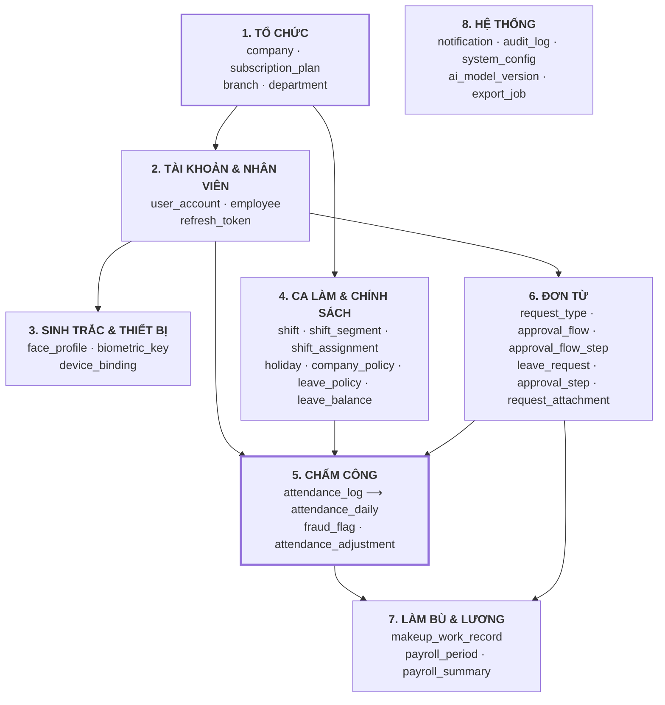

`attendance_log` (nhóm 5) là **trung tâm nghiệp vụ** — mọi nhóm khác tồn tại để phục vụ nó
hoặc tiêu thụ kết quả của nó.

---

## 2. Bản đồ quan hệ tổng thể

Sơ đồ dưới chỉ vẽ **khoá ngoại thật** trong database. Các liên kết logic không có FK
được liệt kê riêng ở [mục 6](#6-quan-hệ-logic-không-có-khoá-ngoại).

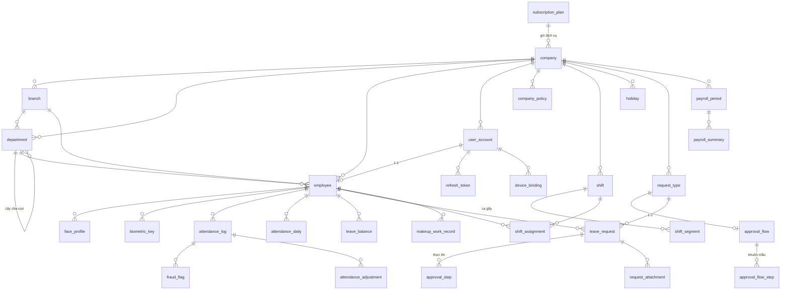

**Năm bảng đứng độc lập**, không có khoá ngoại nào ra/vào:
`audit_log`, `notification`, `export_job`, `ai_model_version`, `SystemConfig`.
Lý do ở [mục 6](#6-quan-hệ-logic-không-có-khoá-ngoại).

---

## 3. Chi tiết từng nhóm

### 3.1. Nhóm TỔ CHỨC — gốc của mọi thứ

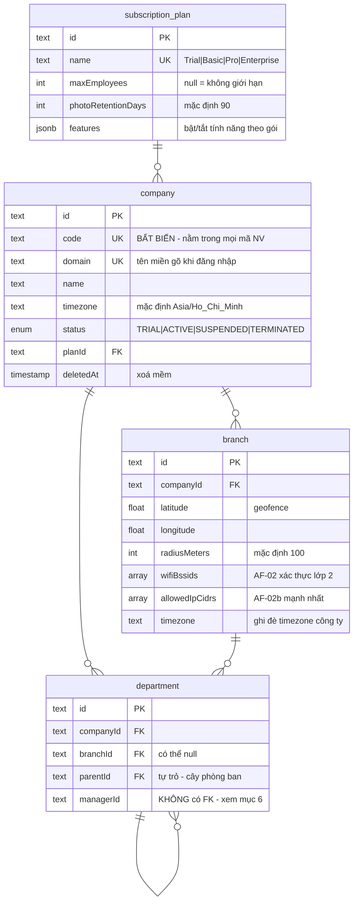

**Điểm cần hiểu:**

- **`company.code` và `company.domain` tách rời nhau** dù nhìn giống nhau. `code` (`"amobi"`)
  đi vào mã nhân viên `ducnv.amobi` nên **bất biến vĩnh viễn**; `domain` (`"amobi.vn"`) là thứ
  người dùng gõ ở màn hình đăng nhập nên đổi được khi công ty đổi thương hiệu.
- **`branch` là nơi định nghĩa "ở công ty nghĩa là ở đâu"** — toạ độ, bán kính, WiFi BSSID và
  dải IP. Ba lớp này mạnh dần: GPS giả được, BSSID phải ở gần mới bắt được, còn IP nguồn thì
  server tự quan sát nên client không khai được.
- **`department.parentId` tự trỏ vào chính bảng** tạo cây phòng ban. Ứng dụng phải tự chặn
  vòng lặp (A→B→A); database không chặn giúp.
- **`department.managerId` KHÔNG có khoá ngoại** tới `employee` — cố ý, vì sẽ tạo phụ thuộc
  vòng: `employee.departmentId → department.managerId → employee`.

---

### 3.2. Nhóm TÀI KHOẢN & NHÂN VIÊN

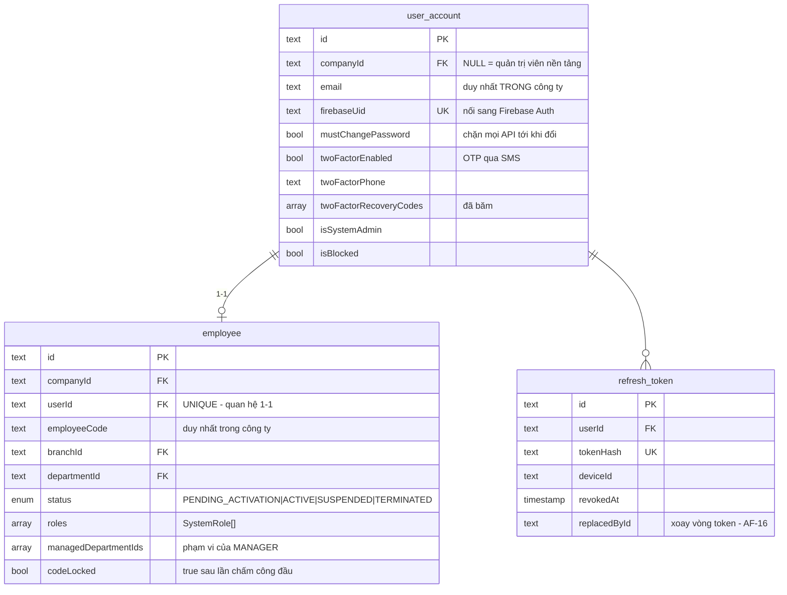

**Điểm cần hiểu:**

- **Mật khẩu KHÔNG nằm trong database này.** `user_account` chỉ giữ `firebaseUid` để nối sang
  Firebase Auth — nơi thực sự lưu email + mật khẩu và kiểm tra khi đăng nhập. Backend không bao
  giờ nhận mật khẩu; client đăng nhập với Firebase trước rồi gửi ID token lên đổi lấy phiên.
  Hệ quả: rò rỉ database này **không làm lộ mật khẩu của ai**.
- **Tách `user_account` khỏi `employee` là quyết định kiến trúc, không phải dư thừa.**
  `user_account` trả lời *"ai đang đăng nhập"*, `employee` trả lời *"ai là nhân sự của công ty"*.
  Quản trị viên nền tảng có `user_account` với `companyId = NULL` và **không có** `employee` —
  họ không thuộc công ty nào. Ngược lại, HR có thể tạo hồ sơ `employee` trước khi cấp tài khoản.
- **Quan hệ 1–1 nhờ `userId @unique`.** Một người làm ở hai công ty sẽ có **hai tài khoản riêng,
  hai mật khẩu riêng** — công ty A không được biết nhân viên còn làm ở đâu.
- **`email` duy nhất theo từng công ty** (`@@unique([companyId, email])`), không phải toàn hệ thống.
  ⚠ Ràng buộc này **không áp dụng cho quản trị viên nền tảng** vì PostgreSQL coi mọi `NULL` là khác
  nhau — cần chỉ mục một phần, xem `prisma/sql/02_auth_constraints.sql`.
- **`refresh_token.replacedById` phục vụ cơ chế xoay vòng (AF-16):** mỗi lần dùng cấp token mới,
  token cũ bị vô hiệu. Dùng lại token đã bị thay thế → thu hồi toàn bộ phiên, vì đó là dấu hiệu
  token bị đánh cắp.

---

### 3.3. Nhóm SINH TRẮC HỌC & THIẾT BỊ

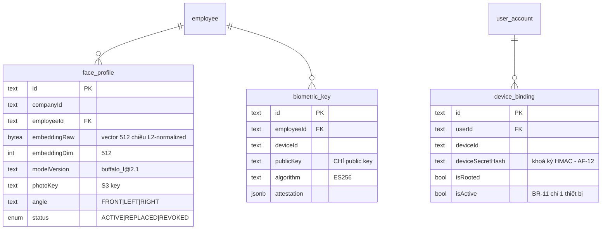

**Điểm cần hiểu:**

- **Server không bao giờ lưu ảnh khuôn mặt gốc để đối chiếu** — chỉ lưu `embeddingRaw`, vector
  512 chiều dạng bytes. Từ vector không dựng lại được khuôn mặt. Tách bảng riêng (nguyên tắc **D8**)
  để hạn chế quyền truy cập.
- **Một nhân viên có NHIỀU `face_profile`** (nhiều góc mặt, nhiều điều kiện ánh sáng). Điểm so khớp
  là điểm cao nhất trong các profile của họ.
- **`biometric_key` chỉ chứa PUBLIC key.** Vân tay không bao giờ rời khỏi thiết bị — hệ điều hành
  giữ private key trong secure enclave. Dữ liệu sinh trắc **không thể rò rỉ từ server vì chưa từng
  ở đó**.
- **`device_binding` gắn với `user_account`, không phải `employee`** — vì đây là khái niệm về
  *phiên đăng nhập*, không phải về *nhân sự*.
- **`deviceSecretHash` là bí mật duy nhất chặn được kẻ đã đánh cắp access token** (AF-12). Nó không
  bao giờ đi kèm token.

---

### 3.4. Nhóm CA LÀM VIỆC & CHÍNH SÁCH

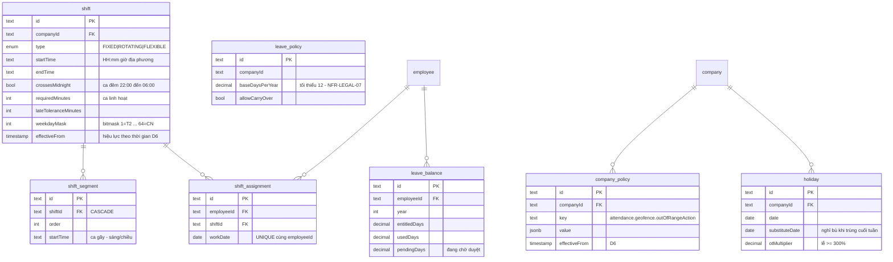

**Điểm cần hiểu:**

- **`company_policy` là bảng key-value, không phải bảng cột cố định** (BR-12). Mỗi công ty tự đặt
  ngưỡng đi muộn, điểm khuôn mặt tối thiểu, hành vi khi ra ngoài geofence. Nhét các ngưỡng này vào
  code nghĩa là mỗi khách hàng mới lại phải sửa mã nguồn.
- **`effectiveFrom` / `effectiveTo` xuất hiện ở `shift`, `company_policy`, `leave_policy`** — đây là
  nguyên tắc **D6**: chính sách có hiệu lực theo thời gian, **không ghi đè lịch sử**. Đổi ngưỡng đi
  muộn hôm nay không được phép tính lại bảng công tháng trước.
- **`shift.crossesMidnight` là cờ nhỏ nhưng sai là hỏng cả bảng công.** Không có nó thì
  `endTime < startTime` (06:00 < 22:00) sẽ ra giờ công âm.
- **`leave_balance.pendingDays` tách khỏi `usedDays`** để đơn đang chờ duyệt vẫn khoá ngày phép —
  nếu không, nhân viên gửi 3 đơn cùng lúc đều thấy "còn đủ phép".
- **`shift_assignment` có `@@unique([employeeId, workDate])`** — một người một ngày chỉ một ca.

---

### 3.5. Nhóm CHẤM CÔNG — trung tâm hệ thống

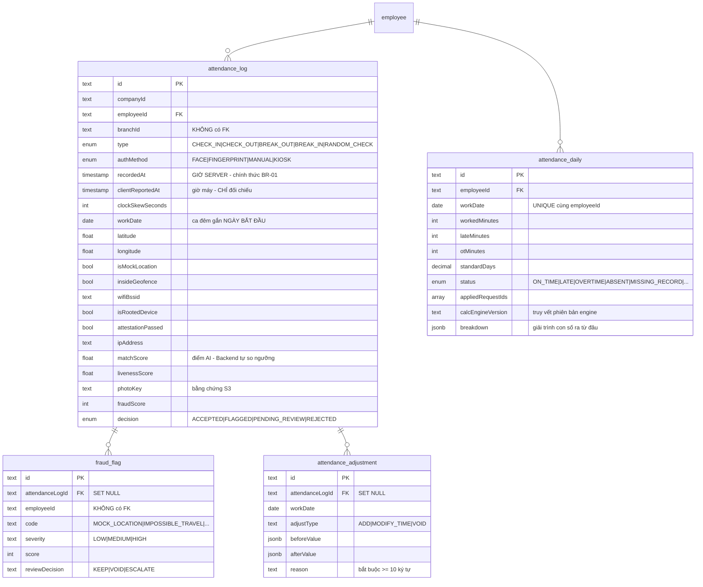

**Đây là phần quan trọng nhất của toàn bộ mô hình dữ liệu.**

#### Tách bảng THÔ và bảng ĐÃ TÍNH (nguyên tắc D1 / ADR-08)

| | `attendance_log` | `attendance_daily` |
|---|---|---|
| Bản chất | Sự kiện thô, từng lượt quẹt | Kết quả tính toán theo ngày |
| Tính chất | **BẤT BIẾN** — không UPDATE, không DELETE | **Tính lại được bất cứ lúc nào** |
| Số dòng | Rất lớn (4 lượt/người/ngày) | 1 dòng/người/ngày |
| Dùng cho | Đối soát khiếu nại, điều tra gian lận | Bảng công, báo cáo, dashboard |

Vì sao phải tách: bản ghi thô là **bằng chứng**. Nếu cho sửa đè, quản lý có thể lặng lẽ đổi giờ vào
của nhân viên mà không để lại dấu vết — mất sạch giá trị đối chứng khi tranh chấp lao động.

Tính bất biến được **cưỡng chế ở tầng database** bằng RULE (đã áp dụng, xác minh trong DB):

```sql
CREATE RULE no_update_attendance_log AS ON UPDATE TO attendance_log DO INSTEAD NOTHING;
CREATE RULE no_delete_attendance_log AS ON DELETE TO attendance_log DO INSTEAD NOTHING;
```

⚠ Rule kiểu `DO INSTEAD NOTHING` khiến lệnh UPDATE/DELETE **bị bỏ qua âm thầm**, không báo lỗi.
Code tưởng đã sửa thành công nhưng dữ liệu không đổi. Đây là chủ đích (lớp phòng thủ cuối), nhưng
người mới cần biết để không mất thời gian gỡ lỗi.

Hệ quả kéo theo: **bảng này chỉ tăng, không bao giờ giảm** — job dọn dữ liệu quá hạn chỉ xoá ảnh
trên S3 chứ không xoá dòng. Đây là lý do chính khiến bảng được thiết kế sẵn cho partition; xem
[mục 8b](#8b-partition-attendance_log--quyết-định-hoãn-và-hồ-sơ-kỹ-thuật) để biết khi nào cần làm
và làm thế nào cho đúng.

#### Luồng dữ liệu

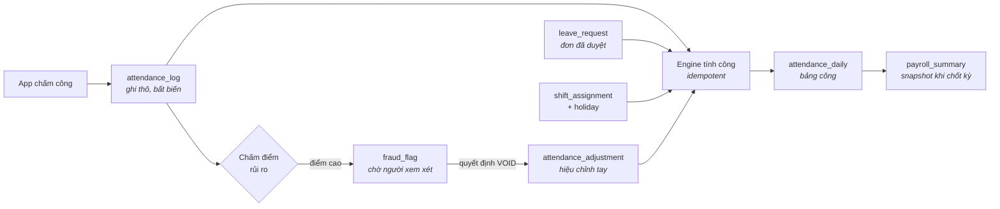

#### Hiệu chỉnh không sửa đè (BR-ADJ-01)

`attendance_adjustment` **không sửa `attendance_log`** mà tạo bản ghi riêng. Bảng công cuối cùng =
bản ghi thô **+** các điều chỉnh chồng lên. Ba loại:

- `ADD` — thêm lượt còn thiếu (quên chấm công, máy hỏng)
- `MODIFY_TIME` — chỉnh giờ của lượt đã có
- `VOID` — vô hiệu hoá lượt sai; **không xoá**, chỉ đánh dấu không tính vào bảng công

`attendanceLogId` có thể `NULL` — đúng với trường hợp `ADD`, khi bổ sung lượt chưa từng tồn tại.

---

### 3.6. Nhóm ĐƠN TỪ — tách khuôn mẫu và thực thi

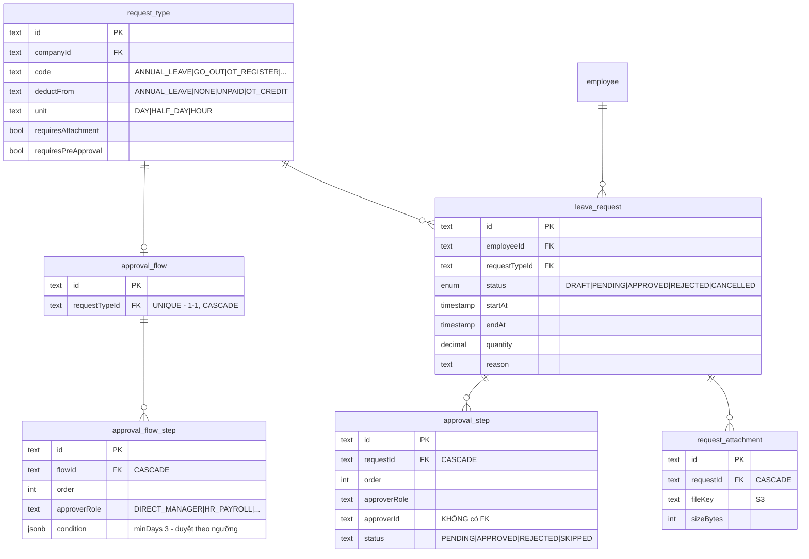

**Điểm cần hiểu — đây là chỗ dễ nhầm nhất:**

Có **hai cặp bảng trông giống nhau nhưng vai trò hoàn toàn khác**:

| Khuôn mẫu (cấu hình 1 lần) | Thực thi (mỗi đơn 1 bộ) |
|---|---|
| `approval_flow` + `approval_flow_step` | `approval_step` |
| *"Đơn nghỉ phép cần trưởng phòng rồi HR duyệt"* | *"Đơn #123 của anh Đức: trưởng phòng đã duyệt, HR đang chờ"* |
| Thuộc về `request_type` | Thuộc về `leave_request` |

Khi nhân viên gửi đơn, hệ thống đọc `approval_flow_step` (khuôn mẫu), lọc theo `condition`
(ví dụ `{"minDays": 3}` — nghỉ dưới 3 ngày thì bỏ qua bước HR), rồi **sinh ra** các bản ghi
`approval_step` cụ thể cho đơn đó.

Nhờ vậy: đổi luồng duyệt hôm nay **không làm hỏng** các đơn đang chạy dở — chúng đã có bộ
`approval_step` riêng.

- **`approval_step.approverId` có thể NULL** = "để ngỏ", ai mang vai trò tương ứng cũng duyệt được.
  Dùng cho `HR_PAYROLL` / `COMPANY_ADMIN`. Chỉ định đích danh thì người đó nghỉ phép là đơn treo.
- **`request_type` cấu hình theo công ty**, không phải enum cứng — mỗi công ty có bộ loại đơn riêng.

---

### 3.7. Nhóm LÀM BÙ & KỲ LƯƠNG

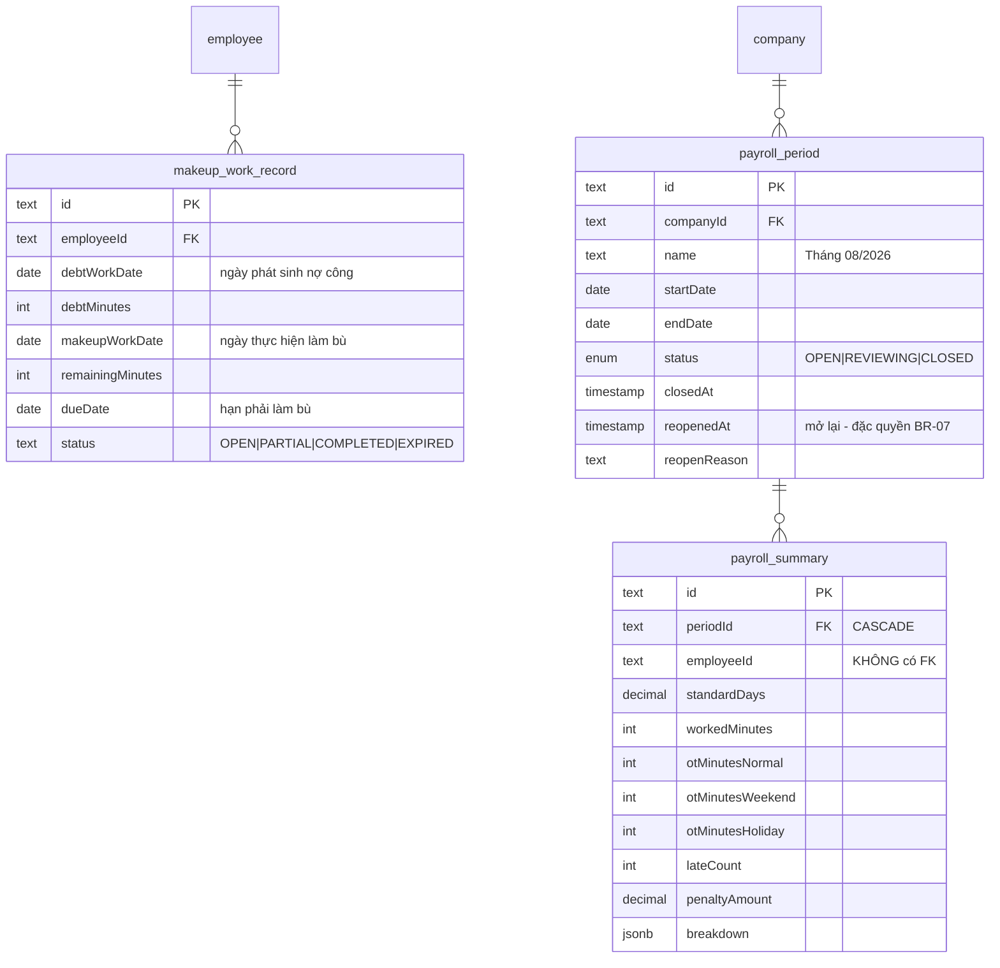

**Điểm cần hiểu:**

- **`payroll_summary` là SNAPSHOT, không phải view.** Khi chốt kỳ, số liệu từ `attendance_daily`
  được **sao chép cứng** vào đây. Sau đó dù `attendance_daily` có được tính lại thì bảng lương đã
  gửi đi vẫn giữ nguyên con số.
- **`payroll_period.status = CLOSED` khoá toàn bộ dữ liệu chấm công trong khoảng thời gian đó** —
  không hiệu chỉnh, không duyệt đơn ảnh hưởng tới kỳ, không tính lại.
- **`reopenedAt` / `reopenReason` tồn tại vì mở lại kỳ là thao tác nguy hiểm**: bảng lương có thể
  đã chi tiền, mở lại rồi ra số khác nghĩa là sổ sách và thực chi lệch nhau.
- **OT tách làm ba cột** (`otMinutesNormal` / `Weekend` / `Holiday`) vì hệ số trả lương khác nhau —
  ngày lễ tối thiểu 300% theo NFR-LEGAL-05.

---

### 3.8. Nhóm HỆ THỐNG

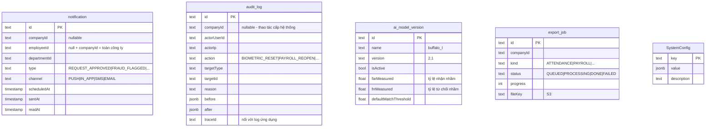

**Điểm cần hiểu:**

- **`audit_log` cũng bất biến ở tầng database** như `attendance_log` — có RULE chặn UPDATE/DELETE.
  Nhật ký sửa được thì mất sạch giá trị đối chứng.
- **`audit_log.companyId` và `notification.companyId` cho phép NULL** — dành cho thao tác cấp hệ
  thống của quản trị viên nền tảng, những người không thuộc công ty nào.
- **`SystemConfig` khác `company_policy`**: cái đầu là cấu hình toàn nền tảng (Admin), cái sau là
  cấu hình theo từng công ty. `SystemConfig` cũng là **bảng duy nhất dùng khoá chính dạng `text`
  ngữ nghĩa** (`key`) thay vì CUID.
- **`ai_model_version` lưu FAR/FRR đo được** để khi đổi model còn biết ngưỡng cũ có dùng lại được
  không — điểm số giữa hai model **không so sánh trực tiếp** với nhau được.

---

## 4. `companyId` — cột quan trọng nhất và cách nó hoạt động

Nguyên tắc **D2 / BR-09**: *mọi truy vấn nghiệp vụ đều lọc theo `companyId` của phiên đăng nhập*.

Nhưng **không phải bảng nào có `companyId` cũng có khoá ngoại tới `company`**. Đây là chủ đích:

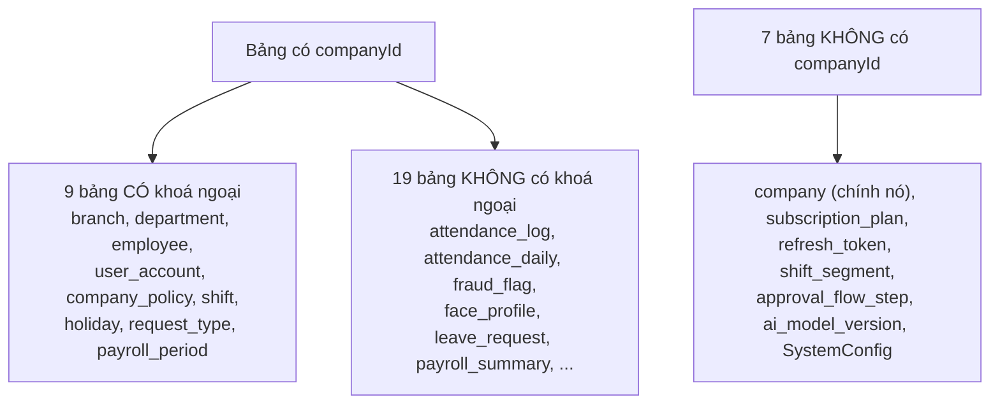

**Vì sao 19 bảng có `companyId` mà không có FK:**

1. **Hiệu năng ghi.** `attendance_log` là bảng ghi nhiều nhất hệ thống. Mỗi FK là một lần kiểm tra
   khoá ngoại lúc INSERT.
2. **Chuẩn bị cho partition.** Bảng đã partition không nhận được FK trỏ vào cột không thuộc khoá
   partition (nguyên tắc **D7**).
3. **`companyId` ở đây đóng vai trò *nhãn phân vùng*, không phải *quan hệ***. Nó luôn suy ra được
   từ `employeeId`; lưu thẳng để **lọc bằng một điều kiện duy nhất, không cần JOIN**.
4. **Chuẩn bị cho Row-Level Security (ADR-05).** Policy RLS so sánh trực tiếp
   `"companyId" = current_setting('app.company_id')` trên từng bảng — cần cột nằm sẵn tại chỗ.

⚠ **Đánh đổi phải biết:** database **không bảo đảm** `attendance_log.companyId` khớp với
`employee.companyId`. Nếu code ghi sai, không có gì chặn lại. Toàn bộ trách nhiệm nằm ở tầng ứng
dụng (`TenantGuard` + repository luôn nhận `companyId`).

**Trạng thái RLS hiện tại: CHƯA BẬT** (0 policy). Khối SQL tương ứng trong
`prisma/sql/01_immutability_and_rls.sql` được comment lại có chủ đích, vì bật RLS đòi hỏi user
database của ứng dụng **không phải superuser** — hiện `dpstalent` là owner của mọi bảng nên có bật
cũng bị bỏ qua.

---

## 5. Bảng tra cứu toàn bộ 35 khoá ngoại

| # | Bảng nguồn | Cột | → Bảng đích | ON DELETE |
|---|---|---|---|---|
| 1 | `approval_flow` | `requestTypeId` | `request_type` | **CASCADE** |
| 2 | `approval_flow_step` | `flowId` | `approval_flow` | **CASCADE** |
| 3 | `approval_step` | `requestId` | `leave_request` | **CASCADE** |
| 4 | `attendance_adjustment` | `attendanceLogId` | `attendance_log` | SET NULL |
| 5 | `attendance_daily` | `employeeId` | `employee` | RESTRICT |
| 6 | `attendance_log` | `employeeId` | `employee` | RESTRICT |
| 7 | `biometric_key` | `employeeId` | `employee` | RESTRICT |
| 8 | `branch` | `companyId` | `company` | RESTRICT |
| 9 | `company` | `planId` | `subscription_plan` | SET NULL |
| 10 | `company_policy` | `companyId` | `company` | RESTRICT |
| 11 | `department` | `branchId` | `branch` | SET NULL |
| 12 | `department` | `companyId` | `company` | RESTRICT |
| 13 | `department` | `parentId` | `department` | SET NULL |
| 14 | `device_binding` | `userId` | `user_account` | RESTRICT |
| 15 | `employee` | `branchId` | `branch` | SET NULL |
| 16 | `employee` | `companyId` | `company` | RESTRICT |
| 17 | `employee` | `departmentId` | `department` | SET NULL |
| 18 | `employee` | `userId` | `user_account` | SET NULL |
| 19 | `face_profile` | `employeeId` | `employee` | RESTRICT |
| 20 | `fraud_flag` | `attendanceLogId` | `attendance_log` | SET NULL |
| 21 | `holiday` | `companyId` | `company` | RESTRICT |
| 22 | `leave_balance` | `employeeId` | `employee` | RESTRICT |
| 23 | `leave_request` | `employeeId` | `employee` | RESTRICT |
| 24 | `leave_request` | `requestTypeId` | `request_type` | RESTRICT |
| 25 | `makeup_work_record` | `employeeId` | `employee` | RESTRICT |
| 26 | `payroll_period` | `companyId` | `company` | RESTRICT |
| 27 | `payroll_summary` | `periodId` | `payroll_period` | **CASCADE** |
| 28 | `refresh_token` | `userId` | `user_account` | RESTRICT |
| 29 | `request_attachment` | `requestId` | `leave_request` | **CASCADE** |
| 30 | `request_type` | `companyId` | `company` | RESTRICT |
| 31 | `shift` | `companyId` | `company` | RESTRICT |
| 32 | `shift_assignment` | `employeeId` | `employee` | RESTRICT |
| 33 | `shift_assignment` | `shiftId` | `shift` | RESTRICT |
| 34 | `shift_segment` | `shiftId` | `shift` | **CASCADE** |
| 35 | `user_account` | `companyId` | `company` | SET NULL |

### Ba nhóm hành vi khi xoá

**RESTRICT (24 khoá)** — mặc định, **chặn xoá**. Không xoá được công ty còn nhân viên, không xoá
được nhân viên còn dữ liệu chấm công. Đây là chốt bảo vệ dữ liệu là chứng từ pháp lý
(NFR-LEGAL-08). Kết hợp với nguyên tắc **D4** (xoá mềm bằng `deletedAt`), thực tế hầu như không có
gì bị xoá cứng.

**CASCADE (5 khoá)** — xoá cha thì xoá con. Chỉ dùng cho **dữ liệu phụ thuộc hoàn toàn**, không có
ý nghĩa khi đứng một mình:
`shift_segment` (đoạn của ca), `approval_flow_step` (bước của luồng), `approval_step` và
`request_attachment` (thuộc về đơn), `payroll_summary` (thuộc về kỳ lương).

**SET NULL (6 khoá)** — mất liên kết nhưng **giữ bản ghi**. Xoá chi nhánh thì nhân viên vẫn còn,
chỉ là chưa gán chi nhánh nào. Đặc biệt quan trọng với `fraud_flag.attendanceLogId` và
`attendance_adjustment.attendanceLogId`: cờ nghi vấn và hiệu chỉnh vẫn phải tồn tại để tra cứu.

---

## 6. Quan hệ logic KHÔNG có khoá ngoại

Đây là phần **dễ gây nhầm lẫn nhất** cho người mới đọc schema. Nhiều cột trông như khoá ngoại
(`...Id`) nhưng database **không hề ràng buộc**:

| Cột | Trỏ tới (logic) | Vì sao không có FK |
|---|---|---|
| `department.managerId` | `employee.id` | Tránh phụ thuộc vòng `employee → department → employee` |
| `attendance_log.branchId` | `branch.id` | Bảng ghi nhiều nhất, tránh chi phí kiểm tra khi INSERT |
| `attendance_daily.shiftId` | `shift.id` | Ca có thể bị xoá mềm; bảng công vẫn phải giữ lịch sử |
| `fraud_flag.employeeId` | `employee.id` | Chuẩn bị partition, tránh FK phụ |
| `attendance_adjustment.employeeId` | `employee.id` | như trên |
| `attendance_adjustment.requestId` | `leave_request.id` | Đơn có thể bị huỷ, hiệu chỉnh vẫn giữ |
| `payroll_summary.employeeId` | `employee.id` | Snapshot phải sống độc lập với hồ sơ nhân sự |
| `makeup_work_record.requestId` | `leave_request.id` | như trên |
| `approval_step.approverId` | `employee.id` | Có thể NULL = "ai có vai trò cũng duyệt được" |
| `notification.employeeId` / `departmentId` | `employee` / `department` | Thông báo là dữ liệu phù du, gửi cả nhóm |
| `audit_log.actorUserId` / `targetId` | nhiều bảng khác nhau | `targetId` là đa hình — trỏ tới bảng nào tuỳ `targetType` |
| `attendance_log.aiModelVersion` | `ai_model_version` | Lưu chuỗi `"buffalo_l@2.1"`, không phải id |
| `export_job.createdBy`, `*.createdByUserId`, `*.revokedBy`, `*.closedBy` | `user_account.id` | Trường truy vết, không phải quan hệ nghiệp vụ |

**Hệ quả thực tế:** đọc schema mà chỉ nhìn khoá ngoại sẽ **thấy thiếu quan hệ**. Muốn hiểu đúng
luồng dữ liệu phải đọc cả `prisma/schema.prisma` (nơi khai báo `@relation`) lẫn code service.

---

## 7. Bảy nguyên tắc thiết kế xuyên suốt

| Mã | Nguyên tắc | Thể hiện ở đâu |
|---|---|---|
| **D1** | Tách bản ghi THÔ và ĐÃ TÍNH | `attendance_log` ⟷ `attendance_daily` |
| **D2** | Mọi bảng nghiệp vụ có `companyId` + index | 28/35 bảng |
| **D3** | Khoá chính CUID, không dùng số tự tăng | Toàn bộ, trừ `SystemConfig` |
| **D4** | Không xoá cứng dữ liệu nghiệp vụ | `deletedAt` ở `company`, `branch`, `department`, `user_account`, `employee`, `shift` |
| **D5** | Lưu thời gian UTC, quy đổi theo timezone công ty | `company.timezone`, `branch.timezone` ghi đè |
| **D6** | Cấu hình chính sách có hiệu lực theo thời gian | `effectiveFrom`/`effectiveTo` ở `shift`, `company_policy`, `leave_policy` |
| **D7** | Bảng lớn thiết kế sẵn cho partition theo tháng | `attendance_log` (chưa partition — xem mục 8) |
| **D8** | Embedding khuôn mặt tách bảng riêng | `face_profile` |

---

## 8. Trạng thái thực tế của database

Số liệu tại thời điểm lập tài liệu:

| Hạng mục | Trạng thái |
|---|---|
| Migration `20260807000000_init` | ✅ Đã áp |
| Migration `20260809000000_firebase_auth` | ⚠️ **CHƯA áp lên database** — xem ghi chú dưới bảng |
| RULE bất biến (`attendance_log`, `audit_log`) | ✅ 4/4 đã tạo |
| Index bổ sung (`db:guards`) | ✅ 3/3 đã tạo |
| RLS policy | ⬜ 0 — **cố ý chưa bật**, cần tách DB role riêng cho ứng dụng |
| Partition `attendance_log` | ⬜ **Đã quyết định hoãn** — xem [mục 8b](#8b-partition-attendance_log--quyết-định-hoãn-và-hồ-sơ-kỹ-thuật) |
| Hàm `create_attendance_log_partition()` | ⬜ **Đã viết nhưng CHƯA nạp vào database** — `npm run db:guards` không chạy `prisma/sql/02_partitioning.sql`, xem ghi chú dưới bảng |

> ⚠ **Database và `schema.prisma` đang LỆCH NHAU.** Migration `20260809000000_firebase_auth`
> đã có trong mã nguồn nhưng chưa chạy trên database. Nó chuyển xác thực sang Firebase:
> **bỏ** `user_account.passwordHash` và `twoFactorSecret`, **thêm** `firebaseUid` (unique) và
> `twoFactorPhone` — tức đổi 2FA từ TOTP sang OTP qua SMS.
>
> Sơ đồ ở [mục 3.2](#32-nhóm-tài-khoản--nhân-viên) đã vẽ theo **schema mới**. Số bảng và số
> khoá ngoại **không đổi** (35 model, 35 FK) vì migration này chỉ sửa cột trong `user_account`.
>
> Chạy `npx prisma migrate deploy` để đồng bộ.

> ⚠ **`02_partitioning.sql` không nằm trong `db:guards`.** Script `db:guards` chỉ chạy
> `01_immutability_and_rls.sql` và `02_auth_constraints.sql`, nên hàm
> `create_attendance_log_partition()` **chưa tồn tại trong database** dù đã viết xong.
> Muốn dùng phải nạp thủ công:
>
> ```bash
> npx prisma db execute --schema prisma/schema.prisma --file prisma/sql/02_partitioning.sql
> ```
>
> Hàm này idempotent (`IF to_regclass(...) IS NOT NULL THEN RETURN`), chạy lại nhiều lần an toàn.

---

## 8b. Partition `attendance_log` — quyết định hoãn và hồ sơ kỹ thuật

> **Trạng thái: ĐÃ QUYẾT ĐỊNH HOÃN.** Không phải bỏ quên, cũng không phải nợ kỹ thuật kiểu
> "sớm muộn cũng vỡ". Mục này ghi lại toàn bộ điều tra để khi đến lúc làm thì không phải
> dò lại từ đầu — và quan trọng hơn, để không ai chọn nhầm phương án.

### 8b.1. Partition để làm gì, và vì sao chưa cần bây giờ

Partition chia một bảng lớn thành nhiều bảng con theo tháng của `workDate`, nhưng ứng dụng
vẫn nhìn thấy **một bảng duy nhất**:

```
attendance_log                 (bảng cha, không chứa dữ liệu)
├── attendance_log_2026_08     ← dữ liệu tháng 8
├── attendance_log_2026_09     ← dữ liệu tháng 9
└── attendance_log_2026_10     ← ...
```

| Lợi ích | Ý nghĩa cụ thể |
|---|---|
| **Cắt vùng quét** | Truy vấn bảng công tháng 8 chỉ đọc partition tháng 8, bỏ qua 100% tháng khác |
| **Chỉ mục nhỏ hơn** | Mỗi partition có index riêng, vừa trong RAM. Index trên bảng 50 triệu dòng thì không |
| **Xoá dữ liệu cũ tức thì** | `DROP TABLE attendance_log_2024_01` mất vài mili-giây, thay vì `DELETE` hàng triệu dòng |

Lợi ích thứ ba đặc biệt quan trọng với hệ thống này, vì một sự thật không hiển nhiên:

> **`attendance_log` CHỈ TĂNG, KHÔNG BAO GIỜ GIẢM.**
>
> RULE `no_delete_attendance_log` chặn mọi lệnh `DELETE`, còn `retention.processor.ts` chỉ
> xoá **ảnh trên S3** chứ không đụng tới dòng dữ liệu (xem `retention.processor.ts` — nó
> chỉ gọi `findMany` trên bảng này, không hề có `deleteMany`).
>
> Hệ quả: nếu sau này có yêu cầu pháp lý hoặc hợp đồng buộc phải xoá dữ liệu chấm công cũ,
> `DROP PARTITION` là cách **duy nhất** khả thi.

⚠ **Mặt trái phải biết trước:** partition mở một lối đi vòng qua chính cơ chế bất biến.
`DELETE` bị RULE chặn, nhưng `DROP TABLE attendance_log_2024_01` là lệnh **DDL** — RULE không
áp dụng. Sau khi partition, cần quy trình vận hành để không ai lỡ tay xoá cả một tháng dữ
liệu chứng từ.

### 8b.2. Vật cản kỹ thuật — vì sao buộc phải đụng tới khoá ngoại

Đây là **ràng buộc của PostgreSQL**, không phải lựa chọn thiết kế. Chuỗi lý do khép kín:

1. **Khoá partition phải nằm trong khoá chính.** PostgreSQL đánh chỉ mục theo từng partition
   riêng (local index), không có chỉ mục toàn cục. Muốn bảo đảm `id` duy nhất trên toàn bảng
   thì mỗi lần INSERT phải quét mọi partition — đúng thứ partition sinh ra để tránh.
2. **Suy ra `UNIQUE (id)` là bất khả thi**, chỉ có `UNIQUE (id, "workDate")`.
3. **Khoá ngoại cần một ràng buộc UNIQUE khớp đúng cột nó trỏ tới.** Hai khoá ngoại hiện có
   đều trỏ vào `attendance_log(id)` → mất chỗ bám.

**Đã kiểm chứng thực nghiệm** trên chính database này (mọi thử nghiệm đều `ROLLBACK`):

| Thử nghiệm | Kết quả |
|---|---|
| `PRIMARY KEY (id)` trên bảng partitioned | ❌ `PRIMARY KEY lacks column "workDate" which is part of the partition key` |
| `PRIMARY KEY (id, "workDate")` | ✅ |
| `UNIQUE (id)` trên bảng partitioned | ❌ `UNIQUE constraint lacks column "workDate"` |
| FK từ bảng khác trỏ vào `(id)` | ❌ `42830: there is no unique constraint matching given keys` |
| **FK trỏ vào cặp `(id, "workDate")`** | ✅ ← lối thoát |

### 8b.3. Điều kiện kích hoạt — khi nào thì làm

Để nguyên như hiện tại **không có gì hỏng**. Chi phí duy nhất của việc hoãn là chuyển đổi về
sau đắt hơn, vì buộc phải chép toàn bộ dữ liệu sang bảng mới:

| Số dòng khi chuyển | Thời gian dừng dịch vụ ước tính |
|---|---|
| 1 dòng (hiện tại) | Tức thì |
| ~1 triệu | Vài chục giây |
| ~10 triệu | Vài phút, cần cửa sổ bảo trì |
| ~50 triệu | Hàng chục phút, cần quy trình chuyển đổi có kế hoạch |

Theo ước tính ở [07-mo-hinh-du-lieu.md](07-mo-hinh-du-lieu.md): 500 nhân viên × 4 lượt/ngày ×
250 ngày ≈ **500.000 dòng/năm/công ty**. PostgreSQL 17 xử lý bảng 10–20 triệu dòng rất thoải
mái nếu index đúng — mà 4 index hiện có của `attendance_log` là đúng. Suy ra ngưỡng quyết định
**không phải thời gian mà là số công ty onboard**: 1 công ty ≈ 20 năm, 10 công ty ≈ 2 năm,
100 công ty ≈ vài tháng.

**Làm partition khi MỘT trong ba điều sau xảy ra, tuỳ cái nào đến trước:**

1. `attendance_log` vượt **5 triệu dòng**
2. Số công ty đang hoạt động vượt **10**
3. Có yêu cầu pháp lý/hợp đồng về việc **xoá dữ liệu chấm công cũ**

Câu lệnh kiểm tra điều kiện 1 và 2:

```sql
SELECT (SELECT count(*) FROM attendance_log)                                    AS so_dong,
       (SELECT count(*) FROM company WHERE status IN ('TRIAL','ACTIVE')
                                       AND "deletedAt" IS NULL)                 AS so_cong_ty;
```

### 8b.4. Phương án ĐÚNG khi thực hiện: khoá ngoại tổ hợp

⚠ **Đừng chọn phương án "bỏ hẳn khoá ngoại".** Nghe thì đơn giản hơn, nhưng có **7 vị trí code
đang phụ thuộc vào quan hệ Prisma này** và sẽ hỏng:

| File | Cách dùng | Mức độ |
|---|---|---|
| `modules/fraud/fraud.service.ts:471` | `include: { attendanceLog: { select } }` | Viết lại được |
| `modules/fraud/fraud.service.ts:507` | `include: { attendanceLog: true }` | Viết lại được |
| `modules/fraud/fraud.controller.ts:88,95` | `flag.attendanceLog.workDate` | Viết lại được |
| `modules/attendance/attendance-admin.service.ts:124` | `include: { fraudFlags, adjustments }` | Viết lại được |
| `modules/attendance/attendance.service.ts:1079` | `include: { fraudFlags, adjustments }` | Viết lại được |
| `modules/report/report.service.ts:138` | `where: { attendanceLog: { workDate: today } }` | **Lọc lồng — nặng** |
| `modules/payroll/payroll-engine.service.ts:155` | `where: { attendanceLog: { workDate } }` | **Lọc lồng — nặng** |

Hai dòng cuối lọc `fraud_flag` theo `workDate` của bản ghi chấm công. Bỏ quan hệ thì phải tách
thành hai bước truy vấn — vừa dài dòng vừa chậm hơn.

**Cách đúng: thêm `workDate` vào `fraud_flag` rồi dùng khoá ngoại tổ hợp.**

```
fraud_flag ("attendanceLogId", "workDate")            →  attendance_log (id, "workDate")
attendance_adjustment ("attendanceLogId", "workDate") →  attendance_log (id, "workDate")
```

Bảng `attendance_adjustment` **đã có sẵn** cột `workDate`, chỉ `fraud_flag` cần thêm.

Được cả bốn thứ cùng lúc:

- ✅ Partition được — khoá chính là `(id, "workDate")`
- ✅ Giữ nguyên toàn vẹn dữ liệu ở tầng database
- ✅ Cả 7 vị trí code trên **vẫn chạy nguyên**, vì quan hệ Prisma vẫn còn
- ➕ Hai truy vấn lọc lồng còn **nhanh hơn**, vì lọc thẳng `fraud_flag."workDate"` không phải JOIN

**Điểm cần xác minh khi thi công:** `attendanceLogId` là nullable (cờ nghi vấn có thể không gắn
với lượt chấm công nào). Prisma yêu cầu các cột trong quan hệ nhiều cột **đồng nhất về tính
nullable** — nếu báo lỗi thì để `workDate` trên `fraud_flag` nullable theo. Phía PostgreSQL không
vấn đề: khoá ngoại tổ hợp có cột NULL sẽ không bị kiểm tra (ngữ nghĩa `MATCH SIMPLE`), đúng ý đồ.

### 8b.5. Các bước thi công

**1. Sửa `prisma/schema.prisma`**
- `AttendanceLog`: đổi `@id` trên `id` thành `@@id([id, workDate])`
- `FraudFlag`: thêm `workDate DateTime @db.Date`, đổi `@relation` sang dạng nhiều cột
- `AttendanceAdjustment`: đổi `@relation` sang dạng nhiều cột (cột `workDate` đã có)

**2. Viết migration SQL thủ công** — Prisma **không tạo được** bảng partitioned:
- Đổi tên `attendance_log` → `attendance_log_old`
- Tạo `attendance_log` mới với `PARTITION BY RANGE ("workDate")`, PK `(id, "workDate")`
- Tạo partition bằng hàm `create_attendance_log_partition()` — **nhớ nạp `02_partitioning.sql` trước**,
  nó không nằm trong `db:guards` (xem ghi chú cuối [mục 8](#8-trạng-thái-thực-tế-của-database))
- Chép dữ liệu, tạo lại **4 index** và **2 RULE bất biến**
- Backfill `fraud_flag."workDate"`, tạo lại 2 khoá ngoại dạng tổ hợp

**3. Bật lịch tạo partition hằng tháng**
- Bỏ comment khối `DO $$` cuối `prisma/sql/02_partitioning.sql`
- Thêm job định kỳ vào `infra/queue/scheduler.service.ts` tạo trước partition tháng sau

> ⚠ **Cảnh báo vận hành quan trọng nhất:** thiếu partition cho tháng hiện tại thì **mọi lượt
> chấm công INSERT sẽ lỗi**. Job tạo trước partition phải có giám sát riêng, không được để nó
> âm thầm chết.

**4. Ghi `workDate` khi tạo cờ nghi vấn** — `fraud.service.ts`, hàm `persistFlags()`

### 8b.6. Kiểm chứng sau khi thi công

```bash
# Bảng đã partitioned, liệt kê đủ partition
psql "$DATABASE_URL" -c "\d+ attendance_log"

# Hai khoá ngoại tổ hợp còn nguyên (kỳ vọng 2 dòng)
psql "$DATABASE_URL" -c "select conname, pg_get_constraintdef(oid) from pg_constraint
  where confrelid='attendance_log'::regclass"

# RULE bất biến được tạo lại (kỳ vọng 2)
psql "$DATABASE_URL" -c "select rulename from pg_rules where tablename='attendance_log'"

# Có cắt vùng quét không — kỳ vọng thấy 'Partitions removed'
psql "$DATABASE_URL" -c "explain select * from attendance_log where \"workDate\" = '2026-08-07'"

# Không mất dữ liệu
psql "$DATABASE_URL" -c "select count(*) from attendance_log"

# Code không hỏng
cd server-backend-smart && npx tsc --noEmit && npx jest
```

Cuối cùng chạy thật một lượt chấm công (`POST /v1/attendance/check-in`) để xác nhận INSERT
vào bảng partitioned hoạt động.

---

## 9. Ghi chú về quy ước đặt tên

⚠ Điểm dễ vấp khi viết SQL thuần trên database này:

`schema.prisma` dùng `@@map` cho **tên bảng** (đổi sang `snake_case`) nhưng **không** dùng `@map`
cho tên cột. Vì vậy trong PostgreSQL:

- Tên bảng: `attendance_log`, `user_account`, `payroll_period` — chữ thường, gạch dưới
- Tên cột: `"companyId"`, `"workDate"`, `"createdAt"` — **giữ nguyên camelCase**

PostgreSQL hạ mọi định danh không đóng ngoặc kép về chữ thường, nên viết `companyId` trần sẽ
thành `companyid` và báo `column does not exist`. **Mọi tên cột trong SQL thuần bắt buộc đóng
ngoặc kép.**

---

## 10. Liên kết tài liệu

- [07-mo-hinh-du-lieu.md](07-mo-hinh-du-lieu.md) — ý đồ thiết kế và lý do nghiệp vụ
- [02-kien-truc-he-thong.md](02-kien-truc-he-thong.md) — kiến trúc tổng thể, ADR
- [06-anti-fraud.md](06-anti-fraud.md) — chi tiết `fraud_flag` và cơ chế chấm điểm
- [12-luong-cham-cong-chi-tiet.md](12-luong-cham-cong-chi-tiet.md) — luồng ghi `attendance_log`
- `server-backend-smart/prisma/schema.prisma` — nguồn sự thật của cấu trúc
- `server-backend-smart/prisma/sql/` — ràng buộc không biểu diễn được bằng Prisma
